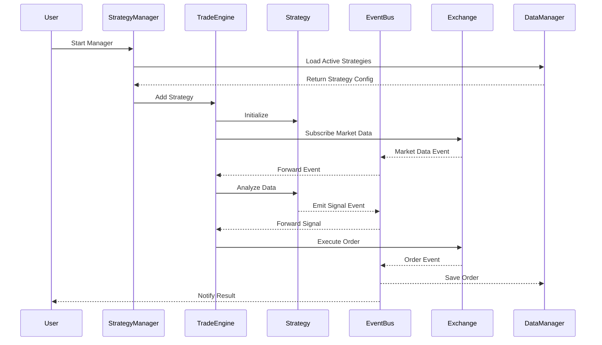
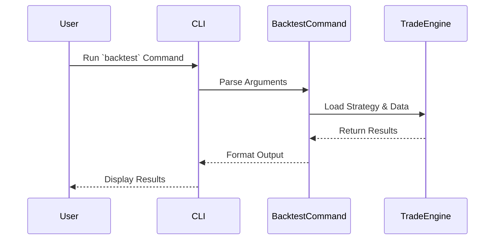
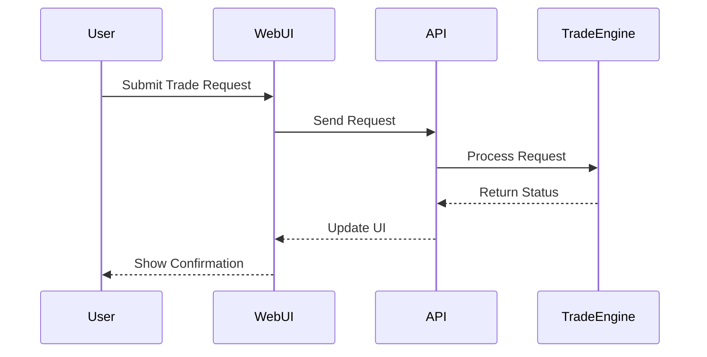

# iTrade

Intelligent and Strategic Trading Platform for Everyone.

iTrade is for study, research purpose only. Don't risk your real assets. Use iTrade at your own risk.

## Core Workflows

### 1. Strategy Execution Flow



### 2. CLI Tool Flow



### 3. Web Manager Flow



## Quick Start

### 1. Install Dependencies

```bash
pnpm add @itrade/core @itrade/strategies @itrade/logger @itrade/risk-manager @itrade/portfolio-manager @itrade/exchange-connectors
```

### 2. Initialize Core Components

```typescript
import { TradingEngine, LogLevel } from '@itrade/core';
import { ConsoleLogger } from '@itrade/logger';
import { RiskManager } from '@itrade/risk-manager';
import { PortfolioManager } from '@itrade/portfolio-manager';
import { Decimal } from 'decimal.js';

// Create logger
const logger = new ConsoleLogger(LogLevel.INFO);

// Create risk manager with custom limits
const riskManager = new RiskManager({
  maxDrawdown: new Decimal(20),        // 20% max drawdown
  maxPositionSize: new Decimal(10),    // 10% max position size
  maxDailyLoss: new Decimal(5),        // 5% max daily loss
  maxLeverage: new Decimal(1),         // 1:1 leverage (no leverage)
});

// Create portfolio manager with initial balance
const portfolioManager = new PortfolioManager(new Decimal(10000)); // $10,000 initial balance

// Create trading engine
const engine = new TradingEngine(riskManager, portfolioManager, logger);
```

### 3. Add a Strategy

```typescript
import { MovingAverageStrategy } from '@itrade/strategies';

const strategy = new MovingAverageStrategy({
  fastPeriod: 10,
  slowPeriod: 30,
  threshold: 0.001,  // 0.1% minimum crossover threshold
});

engine.addStrategy('ma-strategy', strategy);
```

### 4. Configure Exchange

```typescript
import { BinanceExchange } from '@itrade/exchange-connectors';

// Create exchange instance (use true for testnet)
const binance = new BinanceExchange(true); // testnet
await binance.connect({
  apiKey: 'YOUR_API_KEY',
  secretKey: 'YOUR_SECRET_KEY',
  sandbox: true, // Use testnet for safety
});

engine.addExchange('binance', binance);
```

### 5. Initialize Data Manager (Optional but Recommended)

```typescript
import { TypeOrmDataManager } from '@itrade/data-manager';

// Initialize database connection
const dataManager = new TypeOrmDataManager({
  type: 'postgres',
  host: 'localhost',
  port: 5432,
  username: 'postgres',
  password: 'postgres',
  database: 'itrade',
  synchronize: false, // Use migrations in production
});

await dataManager.initialize();
```

### 6. Start the Engine

```typescript
// Start the trading engine
await engine.start();

logger.info('Trading engine started successfully');
```

### 7. Complete Example

```typescript
import { TradingEngine, LogLevel } from '@itrade/core';
import { ConsoleLogger } from '@itrade/logger';
import { RiskManager } from '@itrade/risk-manager';
import { PortfolioManager } from '@itrade/portfolio-manager';
import { MovingAverageStrategy } from '@itrade/strategies';
import { BinanceExchange } from '@itrade/exchange-connectors';
import { TypeOrmDataManager } from '@itrade/data-manager';
import { Decimal } from 'decimal.js';

async function main() {
  // Initialize logger
  const logger = new ConsoleLogger(LogLevel.INFO);
  
  // Initialize database
  const dataManager = new TypeOrmDataManager({
    type: 'postgres',
    host: process.env.DATABASE_HOST || 'localhost',
    port: parseInt(process.env.DATABASE_PORT || '5432'),
    username: process.env.DATABASE_USER || 'postgres',
    password: process.env.DATABASE_PASSWORD || 'postgres',
    database: process.env.DATABASE_NAME || 'itrade',
    synchronize: false,
  });
  await dataManager.initialize();
  logger.info('✅ Database connected');
  
  // Initialize components
  const riskManager = new RiskManager({
    maxDrawdown: new Decimal(20),
    maxPositionSize: new Decimal(10),
    maxDailyLoss: new Decimal(5),
  });
  const portfolioManager = new PortfolioManager(new Decimal(10000));
  
  // Create engine
  const engine = new TradingEngine(riskManager, portfolioManager, logger);
  
  // Add strategy with subscription config
  const strategy = new MovingAverageStrategy({
    symbol: 'BTC/USDT',
    exchange: 'binance',
    fastPeriod: 10,
    slowPeriod: 30,
    threshold: 0.001,  // 0.1% minimum crossover threshold
    subscription: {
      ticker: true,
      klines: true,
      method: 'rest', // Use 'websocket' for real-time data
    },
  });
  engine.addStrategy('ma-strategy', strategy);
  
  // Add exchange (use testnet)
  const binance = new BinanceExchange(true);
  await binance.connect({
    apiKey: process.env.BINANCE_API_KEY || '',
    secretKey: process.env.BINANCE_SECRET_KEY || '',
    sandbox: true,
  });
  engine.addExchange('binance', binance);
  
  // Start trading
  await engine.start();
  
  logger.info('✅ Trading system is running...');
  
  // Graceful shutdown
  process.on('SIGINT', async () => {
    logger.info('Shutting down...');
    await engine.stop();
    await dataManager.close();
    process.exit(0);
  });
}

main().catch(console.error);
```

## Project Structure

```plaintext
itrade/
├── packages/
│   ├── core/               # Core trading engine
│   │   ├── src/engine/     # Trading engine & subscription manager
│   │   ├── src/models/     # Base strategy, OrderManager, OrderSyncService
│   │   └── src/events/     # Event bus system
│   ├── strategies/         # Strategy implementations
│   │   └── src/strategies/
│   │       └── MovingAverageStrategy.ts
│   ├── exchange-connectors/ # Exchange connectors
│   │   └── src/
│   │       ├── binance/    # Binance exchange
│   │       ├── coinbase/   # Coinbase exchange
│   │       └── okx/        # OKX exchange
│   ├── data-manager/       # Data management with TypeORM
│   │   └── src/
│   │       ├── entities/   # Database entities (Order, Strategy, etc.)
│   │       └── repositories/ # Data repositories
│   ├── risk-manager/       # Risk management
│   ├── portfolio-manager/  # Portfolio management
│   ├── logger/             # Logging utilities
│   └── utils/              # Shared utilities
├── apps/
│   ├── console/            # Console application (Node.js)
│   │   ├── src/
│   │   │   ├── main.ts     # Main entry point
│   │   │   ├── strategy-manager.ts  # Strategy sync & monitoring
│   │   │   └── order-tracker.ts     # Order tracking & sync
│   │   └── docs/           # Console-specific docs
│   ├── web/                # Web manager (Next.js)
│   │   ├── app/            # Next.js routes
│   │   ├── components/     # React components
│   │   └── docs/           # Web-specific docs
│   ├── mobile/             # Mobile client (Flutter)
│   │   ├── lib/            # Dart code
│   │   ├── android/        # Android-specific code
│   │   └── ios/            # iOS-specific code
│   └── services/           # Service configurations
│       └── db/             # Docker database setup
├── docs/                   # Project documentation
│   ├── guides/             # User guides & tutorials
│   │   ├── PROJECT_QUICK_START.md
│   │   ├── STRATEGY_MANAGEMENT_GUIDE.md
│   │   ├── STRATEGY-EXAMPLE-CN.md
│   │   └── STRATEGY-FLOW-CN.md
│   ├── architecture/       # Architecture & design docs
│   ├── api/                # API references
│   ├── development/        # Development & implementation docs
│   ├── migration/          # Migration guides
│   └── troubleshooting/    # Troubleshooting guides
├── README.md               # Project overview
└── package.json            # Project configuration
```

## Documentation

### 📖 Quick Start Guides

- [Project Quick Start](./docs/guides/PROJECT_QUICK_START.md) - Get started in minutes
- [快速开始指南 (中文)](./docs/guides/QUICKSTART_CN.md) - 中文快速入门
- [Run Commands Guide](./docs/guides/RUN_COMMANDS.md) - How to run console, web, and mobile apps

### 📚 User Guides

- [Strategy Management Guide](./docs/guides/STRATEGY_MANAGEMENT_GUIDE.md) - How to manage strategies
- [Strategy Examples (CN)](./docs/guides/STRATEGY-EXAMPLE-CN.md) - 策略示例
- [Strategy Examples (EN)](./docs/guides/STRATEGY-EXAMPLE-EN.md) - Strategy examples
- [Strategy Flow (CN)](./docs/guides/STRATEGY-FLOW-CN.md) - 策略执行流程
- [Strategy Flow (EN)](./docs/guides/STRATEGY-FLOW-EN.md) - Strategy execution flow
- [Strategy Debugging Guide](./docs/guides/STRATEGY-DEBUG-GUIDE.md) - How to debug strategies

### 🏗️ Architecture & Design

- [Trading Engine Analysis](./docs/architecture/TRADING-ENGINE-ANALYSIS.md) - Engine architecture overview
- [Market Data API Design](./docs/architecture/DESIGN-ANALYSIS-MARKET-DATA-API.md) - Market data system design
- [Auto-Subscription Design](./docs/architecture/DESIGN-AUTO-SUBSCRIPTION.md) - Auto-subscription mechanism

### 🔧 Development Docs

- [Implementation Summary](./docs/development/IMPLEMENTATION_SUMMARY.md) - Recent implementations
- [Console & Web Improvements](./docs/development/CONSOLE_WEB_IMPROVEMENTS.md) - UI improvements
- [Order Tracker Fix](./docs/development/ORDER_TRACKER_FIX.md) - Order tracking improvements

### 🚀 Migration Guides

- [Typed Market Data Migration](./docs/migration/MIGRATION-GUIDE-TYPED-MARKET-DATA.md) - Migrate to typed market data

### ❓ Troubleshooting

- [Troubleshooting Guide](./docs/troubleshooting/TROUBLESHOOTING.md) - Common issues and solutions
- [Symbol Normalization](./docs/troubleshooting/SYMBOL-NORMALIZATION.md) - Symbol format issues
- [WebSocket Blocked Solution](./docs/troubleshooting/WEBSOCKET-BLOCKED-SOLUTION.md) - Fix WebSocket issues

### 📦 Package-Specific Docs

- [Core Package](./packages/core/docs/) - Core engine documentation
- [Data Manager](./packages/data-manager/) - Database and data management
- [Exchange Connectors](./packages/exchange-connectors/) - Exchange integrations

## Features

### Core Features

- 🏗️ **Modular Architecture** - Clean separation of concerns with packages for core, strategies, exchanges, etc.
- 📊 **Multi-Exchange Support** - Binance, Coinbase, OKX with unified interface
- 📈 **Real-time & Historical Data** - Support for live trading and backtesting
- 🛡️ **Risk Management** - Built-in risk controls (max drawdown, position size, daily loss)
- 💼 **Portfolio Management** - Track balances, positions, and P&L
- 📝 **Strategy Management** - Database-backed strategy lifecycle management
- 🔄 **Auto-Sync** - Automatic synchronization between database and trading engine
- 🔍 **Order Tracking** - Real-time order status monitoring and reconciliation
- 🎯 **Event-Driven** - Event bus for decoupled communication
- 📱 **Multi-Platform** - Console, Web (Next.js), and Mobile (Flutter) applications

### Advanced Components

#### StrategyManager

Manages strategy lifecycle with automatic database synchronization:

- **Auto-loading** - Loads active strategies from database on startup
- **Periodic Sync** - Syncs strategies with database every 10 seconds
- **Status Tracking** - Monitors strategy performance and metrics
- **Error Handling** - Automatically handles strategy failures

Example usage:

```typescript
import { StrategyManager } from './strategy-manager';

const strategyManager = new StrategyManager(engine, dataManager, logger);
await strategyManager.start();

// Strategies are automatically loaded and synced with database
// Changes in database (add/pause/stop) are reflected in TradeEngine
```

#### OrderTracker

Monitors and syncs orders between exchange and database:

- **Real-time Monitoring** - Tracks order status changes
- **Auto-Sync** - Periodic synchronization with exchange
- **Status Updates** - Updates database with latest order states
- **Fill Tracking** - Tracks partial and full fills

Example usage:

```typescript
import { OrderTracker } from './order-tracker';

const orderTracker = new OrderTracker(dataManager, logger);
await orderTracker.start();

// Orders are automatically tracked and synced
// Database is updated with real-time order status
```

## FAQ

### Q1: How to debug strategies?

Use the logger in your strategy:

```typescript
// In your strategy's analyze method
this.logger.info(`Fast MA: ${fastMA}, Slow MA: ${slowMA}`);
this.logger.debug(`Current price: ${currentPrice.toString()}`);
```

### Q2: How to add a new exchange?

Implement the `IExchange` interface by extending `BaseExchange` (refer to `BinanceExchange` or `CoinbaseExchange` implementation):

```typescript
import { BaseExchange, ExchangeCredentials, ExchangeInfo } from '@itrade/exchange-connectors';

export class CustomExchange extends BaseExchange {
  async connect(credentials: ExchangeCredentials): Promise<void> {
    // Implement connection logic
  }

  async getExchangeInfo(): Promise<ExchangeInfo> {
    // Implement exchange info retrieval
  }

  // Implement other required methods...
}
```

### Q3: How to run backtests?

Use the `BacktestEngine` from `@itrade/backtesting`:

```typescript
import { BacktestEngine } from '@itrade/backtesting';
import { MovingAverageStrategy } from '@itrade/strategies';
import { TypeOrmDataManager } from '@itrade/data-manager';
import { Decimal } from 'decimal.js';

// Initialize data manager
const dataManager = new TypeOrmDataManager({
  type: 'postgres',
  host: 'localhost',
  port: 5432,
  username: 'postgres',
  password: 'postgres',
  database: 'itrade',
});
await dataManager.initialize();

// Create backtest engine
const backtestEngine = new BacktestEngine();

// Create strategy
const strategy = new MovingAverageStrategy({
  symbol: 'BTC/USDT',
  exchange: 'binance',
  fastPeriod: 10,
  slowPeriod: 30,
  threshold: 0.001,  // 0.1% minimum crossover threshold
});

// Configure backtest
const config = {
  symbols: ['BTC/USDT'],
  startDate: new Date('2024-01-01'),
  endDate: new Date('2024-12-31'),
  initialBalance: new Decimal(10000),
  interval: '1h',
};

// Run backtest
const results = await backtestEngine.runBacktest(strategy, config, dataManager);

console.log('Backtest Results:', results);
```

### Q4: How to use with production database?

For production environments, use proper database configuration:

```typescript
import { TypeOrmDataManager } from '@itrade/data-manager';

const dataManager = new TypeOrmDataManager({
  type: 'postgres',
  host: process.env.DATABASE_HOST,
  port: parseInt(process.env.DATABASE_PORT || '5432'),
  username: process.env.DATABASE_USER,
  password: process.env.DATABASE_PASSWORD,
  database: process.env.DATABASE_NAME,
  ssl: process.env.NODE_ENV === 'production',
  synchronize: false, // Never use synchronize in production
  logging: ['error', 'warn'],
});

await dataManager.initialize();
```

## Next Steps

### For Beginners

1. 📖 **Read the Quick Start Guide** - [Project Quick Start](./docs/guides/PROJECT_QUICK_START.md)
2. 🎯 **Try the Console Application** - [Run Commands Guide](./docs/guides/RUN_COMMANDS.md)
3. 📝 **Understand Strategy Flow** - [Strategy Flow Guide](./docs/guides/STRATEGY-FLOW-EN.md)
4. 💡 **Create Your First Strategy** - [Strategy Examples](./docs/guides/STRATEGY-EXAMPLE-EN.md)

### For Advanced Users

1. 🏗️ **Study the Architecture** - [Trading Engine Analysis](./docs/architecture/TRADING-ENGINE-ANALYSIS.md)
2. 🔌 **Add Custom Exchange** - Implement `IExchange` interface
3. 🧪 **Run Backtests** - Use `BacktestEngine` with historical data
4. 📊 **Build Custom Strategies** - Extend `BaseStrategy` class
5. 🌐 **Deploy Web Interface** - Use the Next.js web application
6. 📱 **Try Mobile App** - Run the Flutter mobile application

### For Contributors

1. 📚 **Read Documentation Guide** - [Documentation Guide](./docs/guides/DOCUMENTATION_GUIDE.md)
2. 🔧 **Check Development Docs** - [Implementation Summary](./docs/development/IMPLEMENTATION_SUMMARY.md)
3. 🐛 **Report Issues** - Create GitHub issues with detailed information
4. 💻 **Submit PRs** - Follow the project structure and coding standards

## Support

- 📖 **Documentation**: Browse the [docs](./docs/) directory
- 💬 **Issues**: Report bugs or request features on GitHub
- 🌟 **Star this repo** if you find it helpful!

## License

This project is for study and research purposes only. Don't risk your real assets. Use iTrade at your own risk.

---

Made with ❤️ for the trading community
