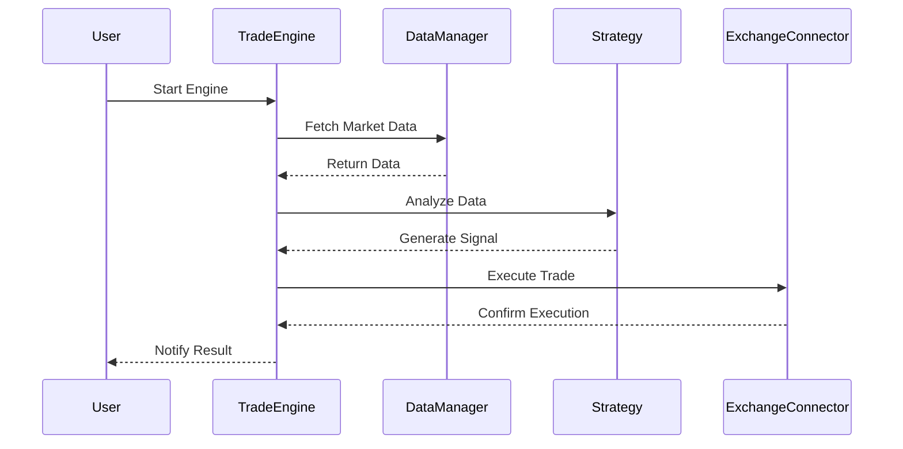
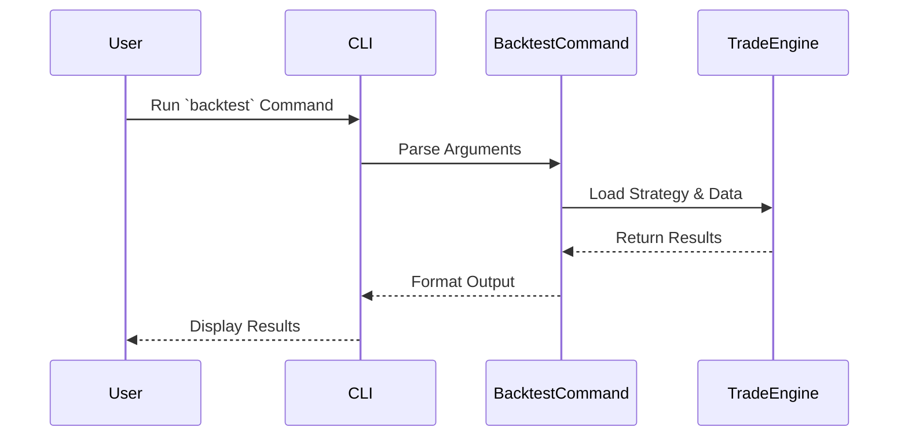
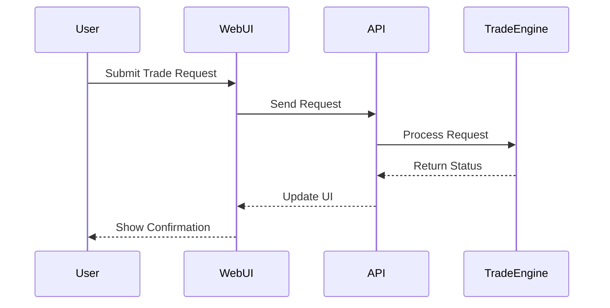

# iTrade

Intelligent and Strategic Trading Platform for Everyone.

iTrade is for study, research purpose only. Don't risk your real assets. Use iTrade at your own risk.

## Core Workflows

### 1. Strategy Execution Flow



### 2. CLI Tool Flow



### 3. Web Manager Flow



## Quick Start

### 1. Install Dependencies

```bash
pnpm add @itrade/core @itrade/strategies @itrade/logger @itrade/risk-manager @itrade/portfolio-manager @itrade/exchange-connectors
```

### 2. Initialize Core Components

```typescript
import { TradingEngine, LogLevel } from '@itrade/core';
import { ConsoleLogger } from '@itrade/logger';
import { RiskManager } from '@itrade/risk-manager';
import { PortfolioManager } from '@itrade/portfolio-manager';
import { Decimal } from 'decimal.js';

// Create logger
const logger = new ConsoleLogger(LogLevel.INFO);

// Create risk manager with custom limits
const riskManager = new RiskManager({
  maxDrawdown: new Decimal(20),        // 20% max drawdown
  maxPositionSize: new Decimal(10),    // 10% max position size
  maxDailyLoss: new Decimal(5),        // 5% max daily loss
  maxLeverage: new Decimal(1),         // 1:1 leverage (no leverage)
});

// Create portfolio manager with initial balance
const portfolioManager = new PortfolioManager(new Decimal(10000)); // $10,000 initial balance

// Create trading engine
const engine = new TradingEngine(riskManager, portfolioManager, logger);
```

### 3. Add a Strategy

```typescript
import { MovingAverageStrategy } from '@itrade/strategies';

const strategy = new MovingAverageStrategy({
  fastPeriod: 10,
  slowPeriod: 30,
  threshold: 0.001,  // 0.1% minimum crossover threshold
});

engine.addStrategy('ma-strategy', strategy);
```

### 4. Configure Exchange

```typescript
import { BinanceExchange } from '@itrade/exchange-connectors';

const binance = new BinanceExchange();
await binance.connect({
  apiKey: 'YOUR_API_KEY',
  secretKey: 'YOUR_SECRET_KEY',
  sandbox: false, // Use true for testnet
});

engine.addExchange('binance', binance);
```

### 5. Start the Engine

```typescript
// Start the trading engine
await engine.start();

logger.info('Trading engine started successfully');
```

### 6. Complete Example

```typescript
import { TradingEngine, LogLevel } from '@itrade/core';
import { ConsoleLogger } from '@itrade/logger';
import { RiskManager } from '@itrade/risk-manager';
import { PortfolioManager } from '@itrade/portfolio-manager';
import { MovingAverageStrategy } from '@itrade/strategies';
import { BinanceExchange } from '@itrade/exchange-connectors';
import { Decimal } from 'decimal.js';

async function main() {
  // Initialize components
  const logger = new ConsoleLogger(LogLevel.INFO);
  const riskManager = new RiskManager({
    maxDrawdown: new Decimal(20),
    maxPositionSize: new Decimal(10),
    maxDailyLoss: new Decimal(5),
  });
  const portfolioManager = new PortfolioManager(new Decimal(10000));
  
  // Create engine
  const engine = new TradingEngine(riskManager, portfolioManager, logger);
  
  // Add strategy
  const strategy = new MovingAverageStrategy({
    fastPeriod: 10,
    slowPeriod: 30,
    threshold: 0.001,  // 0.1% minimum crossover threshold
  });
  engine.addStrategy('ma-strategy', strategy);
  
  // Add exchange
  const binance = new BinanceExchange();
  await binance.connect({
    apiKey: process.env.BINANCE_API_KEY || '',
    secretKey: process.env.BINANCE_SECRET_KEY || '',
    sandbox: true, // Use testnet for safety
  });
  engine.addExchange('binance', binance);
  
  // Start trading
  await engine.start();
  
  logger.info('Trading system is running...');
}

main().catch(console.error);
```

## Project Structure

```
itrade/
├── packages/
│   ├── core/               # Core module
│   ├── strategies/        # Strategy implementations
│   │   └── src/strategies/
│   │       └── MovingAverageStrategy.ts
│   ├── exchange-connectors/ # Exchange connectors
│   ├── data-manager/      # Data management
│   ├── risk-management/   # Risk management
│   └── event-bus/         # Event bus
├── apps/
│   ├── cli/               # CLI tool
│   │   ├── src/commands/BacktestCommand.ts
│   │   └── src/index.ts
│   ├── mobile/           # Mobile client (Flutter)
│   │   ├── lib/          # Dart code
│   │   ├── android/      # Android-specific code
│   │   └── ios/         # iOS-specific code
│   ├── web/             # Web manager (Next.js)
│   │   ├── app/         # Next.js routes
│   │   ├── components/  # React components
│   │   └── public/     # Static assets
│   └── services/       # Service configurations (e.g., Docker)
├── docs/                # Documentation
│   ├── strategy-example-cn.md
│   ├── strategy-flow-cn.md
│   ├── strategy-example-en.md
│   └── strategy-flow-en.md
├── README.md           # Project overview
└── package.json        # Project configuration
```

## Documentation

### Chinese

- [策略示例](./docs/strategy-example-cn.md)
- [策略执行流程](./docs/strategy-flow-cn.md)

### English

- [Strategy Example](./docs/strategy-example-en.md)
- [Strategy Execution Flow](./docs/strategy-flow-en.md)

## Features

- Modular design for easy extension.
- Supports real-time data and historical backtesting.
- Integrated risk management.

## FAQ

### Q1: How to debug strategies?

Use the logger in your strategy:

```typescript
// In your strategy's analyze method
this.logger.info(`Fast MA: ${fastMA}, Slow MA: ${slowMA}`);
this.logger.debug(`Current price: ${currentPrice.toString()}`);
```

### Q2: How to add a new exchange?

Implement the `IExchange` interface by extending `BaseExchange` (refer to `BinanceExchange` or `CoinbaseExchange` implementation):

```typescript
import { BaseExchange, ExchangeCredentials, ExchangeInfo } from '@itrade/exchange-connectors';

export class CustomExchange extends BaseExchange {
  async connect(credentials: ExchangeCredentials): Promise<void> {
    // Implement connection logic
  }

  async getExchangeInfo(): Promise<ExchangeInfo> {
    // Implement exchange info retrieval
  }

  // Implement other required methods...
}
```

### Q3: How to run backtests?

Use the `BacktestEngine` from `@itrade/backtesting`:

```typescript
import { BacktestEngine } from '@itrade/backtesting';
import { MovingAverageStrategy } from '@itrade/strategies';
import { DataManager } from '@itrade/data-manager';
import { Decimal } from 'decimal.js';

const backtestEngine = new BacktestEngine();
const strategy = new MovingAverageStrategy({
  fastPeriod: 10,
  slowPeriod: 30,
  threshold: 0.001,  // 0.1% minimum crossover threshold
});

const config = {
  symbols: ['BTC/USDT'],
  startDate: new Date('2024-01-01'),
  endDate: new Date('2024-12-31'),
  initialBalance: new Decimal(10000),
  interval: '1h',
};

const dataManager = new DataManager(/* config */);
const results = await backtestEngine.runBacktest(strategy, config, dataManager);

console.log('Backtest Results:', results);
```

## Next Steps

- Explore dynamic strategy loading.
- Read detailed module documentation.
