# iTrade

A crypto strategy trading platform with modular architecture.

## Core Workflows

### 1. Strategy Execution Flow


### 2. CLI Tool Flow


### 3. Web Manager Flow


## Quick Start

### 1. Install Dependencies

```bash
yarn add @crypto-trading/core @crypto-trading/strategies
```

### 2. Create a Strategy

Implement a strategy (e.g., `MovingAverageStrategy`) by extending `BaseStrategy`.

### 3. Register and Run

```typescript
import { TradeEngine } from '@crypto-trading/core';
import { MovingAverageStrategy } from './strategies/moving-average-strategy';

const engine = new TradeEngine();
const strategy = new MovingAverageStrategy();
engine.registerStrategy(strategy);

// Start the engine
engine.start();
```

### 4. Configure Exchange

```typescript
import { BinanceConnector } from '@crypto-trading/exchange-connectors';

const binance = new BinanceConnector({ apiKey: 'YOUR_API_KEY' });
engine.addExchange(binance);
```

### 5. Run the Project

```bash
node index.ts
```

## Project Structure

```
itrade/
├── packages/
│   ├── core/               # Core module
│   ├── strategies/        # Strategy implementations
│   │   └── src/strategies/
│   │       └── MovingAverageStrategy.ts
│   ├── exchange-connectors/ # Exchange connectors
│   ├── data-manager/      # Data management
│   ├── risk-management/   # Risk management
│   └── event-bus/         # Event bus
├── apps/
│   ├── cli/               # CLI tool
│   │   ├── src/commands/BacktestCommand.ts
│   │   └── src/index.ts
│   ├── mobile/           # Mobile client (Flutter)
│   │   ├── lib/          # Dart code
│   │   ├── android/      # Android-specific code
│   │   └── ios/         # iOS-specific code
│   ├── web/             # Web manager (Next.js)
│   │   ├── app/         # Next.js routes
│   │   ├── components/  # React components
│   │   └── public/     # Static assets
│   └── services/       # Service configurations (e.g., Docker)
├── docs/                # Documentation
│   ├── strategy-example-cn.md
│   ├── strategy-flow-cn.md
│   ├── strategy-example-en.md
│   └── strategy-flow-en.md
├── README.md           # Project overview
└── package.json        # Project configuration
```

## Tech Stack

```mermaid
---
config:
  theme: base
---
flowchart TD
    subgraph UI["Web UI"]
        NextJS["Next.js (v15.5.4)"]
        React["React (v19.0.0)"]
        ShadcnUI["Shadcn UI"]
        Radix["Radix UI"]
        Recharts["Recharts (v2.15.4)"]
        FramerMotion["Framer Motion (v12.23.22)"]
        Tailwind["Tailwind CSS"]
    end
    subgraph Mobile["Mobile UI"]
        Dart["Dart (v3.2.0)"]
        Flutter["Flutter (v3.22.0)"]
        Material["Material UI"]
        Echart["Flutter_Echart"]
        FirebaseMessaging["Firebase Cloud Messaging"]
    end
    subgraph State["State Management"]
        ReactHookForm["React Hook Form (v7.63.0)"]
        Zod["Zod (v4.1.11)"]
        TanStack["TanStack Table (v8.21.3)"]
    end
    subgraph Data["API & Data Layer"]
        Axios["Axios (v1.6.7)"]
        WebSocket["WebSocket (ws v8.16.0)"]
        Firebase["Firebase Admin (v13.5.0)"]
    end
    subgraph Core["Core Modules"]
        TradingEngine["Trading Engine"]
        Strategies["Strategies"]
        RiskManager["Risk Manager"]
        PortfolioManager["Portfolio Manager"]
        ExchangeConnector["Exchange Connector"]
    end
    subgraph Database["Database & ORM"]
        PostgreSQL["PostgreSQL (pg v8.11.3)"] 
        TypeORM["TypeORM (v0.3.17)"]
    end
    subgraph Build["Build & Tooling"]
        Turbo["Turbo"]
        PNPM["PNPM"]
        ESLint["ESLint"]
    end
    subgraph Testing["Testing & QA"]
        Vitest["Vitest"] 
        FlutterTest["Flutter Test"]
    end
    subgraph Infra["CI/CD & Deployment"]
        Docker["Docker"]
        DockerCompose["Docker Compose"]
        Nginx["Nginx"]
        NginxProxyManager["Nginx Proxy Manager"] 
    end
    subgraph Maintenance["Monitoring"]
        GoogleAnalystic["Google Analytics"]
        Sentry["Sentry"]
    end
    UI --> State
    Mobile --> State
    State --> Data
    Data --> Core
    Core --> Database
    Database --> Build
    Build --> Testing
    Testing --> Infra
    Infra --> Maintenance
    style NextJS fill:#FF6D00
    style React fill:#FF6D00
    style Flutter fill:#2962FF
    style TanStack fill:#00C853
    style TypeORM fill:#00C853
    style Docker fill:#2962FF
```



## Documentation

### Chinese

- [策略示例](./docs/strategy-example-cn.md)
- [策略执行流程](./docs/strategy-flow-cn.md)

### English

- [Strategy Example](./docs/strategy-example-en.md)
- [Strategy Execution Flow](./docs/strategy-flow-en.md)

## Features

- Modular design for easy extension.
- Supports real-time data and historical backtesting.
- Integrated risk management.

## FAQ

### Q1: How to debug strategies?

Add logs in the `analyze` method:

```typescript
console.log(`Fast MA: ${fastMA}, Slow MA: ${slowMA}`);
```

### Q2: How to add a new exchange?

Implement the `IExchangeConnector` interface (refer to `BinanceConnector`).

## Roadmap

- [ ] Improve Backtest mode for strategy
- [ ] Support Dry-Run mode for strategy
