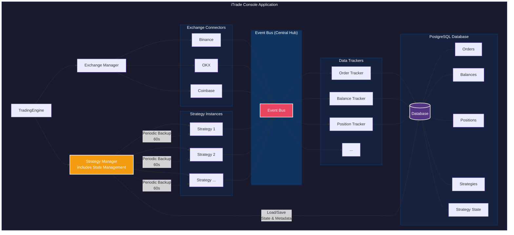

# iTrade Console Application Architecture

This document provides a comprehensive architectural overview of the iTrade Console Application, illustrating the relationships between core components, data flow, and system interactions.

## Table of Contents

- [Overview](#overview)
- [Architecture Diagram](#architecture-diagram)
- [Core Components](#core-components)
- [Data Flow](#data-flow)
- [Component Descriptions](#component-descriptions)
- [Related Documentation](#related-documentation)

## Overview

The iTrade Console Application is built on an event-driven architecture that connects multiple cryptocurrency exchanges, manages trading strategies, and persists trading data. The system uses an Event Bus as the central communication hub, enabling loose coupling between components.

## Architecture Diagram



## Core Components

### 1. TradingEngine

The central orchestrator that initializes and coordinates all system components.

**Responsibilities:**

- Initialize Exchange Manager and Strategy Manager
- Coordinate system startup and shutdown
- Handle graceful cleanup on exit

### 2. Exchange Manager

Manages connections to multiple cryptocurrency exchanges.

**Responsibilities:**

- Initialize exchange connectors (Binance, OKX, Coinbase)
- Route exchange-specific operations
- Handle exchange connection lifecycle
- Subscribe to user data streams (orders, balances, positions)

**Supported Exchanges:**

- **Binance**: WebSocket + REST API
- **OKX**: WebSocket + REST API
- **Coinbase**: WebSocket + REST API

### 3. Strategy Manager

Manages the lifecycle of trading strategies **including state management and monitoring**.

**Responsibilities:**

- Load strategies from database
- Initialize strategy instances
- Start/stop strategies
- Monitor strategy health and performance
- **Periodic state backup (every 60 seconds)**
- **State recovery on startup**
- Sync strategies with database (every 10 minutes)
- Performance reporting

**Internal Components:**

1. **StrategyStateManager**: Handles state persistence and recovery
   - Saves strategy state to `strategy_states` table
   - Recovers state from database on startup
   - Syncs open orders with exchange
   - Validates data consistency

2. **StrategyStateMonitor**: Monitors state management health
   - Tracks backup success/failure rates
   - Monitors recovery performance
   - Emits alerts for issues (excessive failures, slow recovery, corruption)
   - Generates health reports

**State Management Flow:**

- **Periodic Backup** (every 60s):
  1. Calls `strategy.saveState()` on each active strategy
  2. Persists state snapshot to database
  3. Records success/failure metrics

- **Recovery on Startup**:
  1. Loads saved state from `strategy_states` table
  2. Queries open orders from database
  3. Syncs order status with exchange API
  4. Validates position calculations
  5. Calls `strategy.loadState(snapshot)`
  6. Strategy resumes with recovered state

**Configuration:**

```typescript
SYNC_INTERVAL_MS: 600000        // Sync with DB every 10 minutes
REPORT_INTERVAL_MS: 600000      // Report metrics every 10 minutes
STATE_BACKUP_INTERVAL_MS: 60000 // Backup state every 60 seconds
```

**Monitoring & Alerts:**

- **Excessive Failures**: Too many recovery failures
- **Slow Recovery**: Recovery taking too long
- **State Corruption**: Invalid state detected
- **Data Inconsistency**: Position/order mismatches

### 4. Event Bus (Central Hub)

The backbone of the system, enabling event-driven communication between components.

**Key Features:**

- Decoupled component communication
- Type-safe event emission and subscription
- Real-time data distribution

**Event Types:**

- Market data events (ticker, orderbook, trades)
- User data events (orders, balances, positions)
- Strategy events (signals, state changes)
- System events (errors, status updates)

### 6. Exchange Connectors

Individual exchange implementations providing unified interfaces.

**Common Features:**

- WebSocket connections for real-time data
- REST API for account operations
- Symbol normalization
- Error handling and reconnection logic

### 7. Data Trackers

Specialized components that listen to Event Bus and persist data.

**Tracker Types:**

- **Order Tracker**: Monitors and persists order updates
- **Balance Tracker**: Tracks account balance changes
- **Position Tracker**: Tracks open positions
- **Trade Tracker**: Records executed trades

### 8. PostgreSQL Database

Persistent storage for all trading data.

**Schema Entities:**

- **Orders**: Order history and state
- **Balances**: Account balance snapshots
- **Positions**: Open position records
- **Strategies**: Strategy configurations and metadata
- **Strategy State**: Runtime state snapshots for recovery
- **Trades**: Executed trade records
- **Symbols**: Trading pair metadata

## Data Flow

### 1. Market Data Flow

```
Exchange WebSocket → Exchange Connector → Event Bus → Strategy → Trading Logic
```

**Example:**

1. Binance WebSocket receives ticker update
2. BinanceExchange normalizes data and emits event
3. Event Bus broadcasts to all subscribers
4. Active strategies receive market data
5. Strategies analyze and potentially generate trading signals

### 2. User Data Flow

```
Exchange WebSocket → Exchange Connector → Event Bus → Tracker → Database
```

**Example:**

1. Exchange sends order update via WebSocket
2. Exchange connector normalizes order data
3. Event Bus broadcasts order event
4. Order Tracker receives and persists to database

### 3. Trading Signal Flow

```
Strategy → Event Bus → TradingEngine → Exchange Manager → Exchange API
```

**Example:**

1. Strategy generates buy signal
2. Emits signal event to Event Bus
3. TradingEngine receives signal
4. Routes to Exchange Manager
5. Exchange Manager executes order via REST API

### 4. Strategy Lifecycle

```
Database → Strategy Manager → Strategy Instance → Event Bus
```

**Initialization:**

1. Strategy Manager loads from database
2. Creates strategy instances
3. Subscribes strategies to required market data
4. Strategies start listening to Event Bus

**Runtime:**

1. Strategies receive market data via Event Bus
2. Execute trading logic
3. Emit signals when conditions met
4. Persist state changes to database

### 5. Strategy State Management Flow

```
Strategy Manager → Strategy.saveState() → Database (Every 60s)
Database → Strategy Manager → Strategy.loadState() → Recovered (On Startup)
```

**Periodic State Backup (Every 60 seconds):**

1. Strategy Manager timer triggers (`STATE_BACKUP_INTERVAL_MS`)
2. Iterates through all active strategies
3. Calls `strategy.saveState()` to get state snapshot
4. Calls `stateManager.saveStrategyState(strategyId, snapshot)`
5. Persists to `strategy_states` table in database
6. Records success/failure metrics via `stateMonitor`

**Recovery on Startup:**

1. Strategy Manager loads active strategies from database
2. For each strategy, calls `stateManager.recoverStrategyState(strategyId)`
3. Loads saved state from `strategy_states` table
4. Queries open orders from database
5. Syncs order status with exchange REST API
6. Validates position calculations
7. Calls `strategy.loadState(snapshot)` to restore runtime state
8. Strategy resumes with recovered indicators and variables

**Benefits:**

- **Fault Tolerance**: System survives crashes and restarts
- **Data Continuity**: No loss of indicator calculations (MA, RSI, etc.)
- **Quick Recovery**: Strategies resume within seconds, not minutes
- **Debugging**: Historical state snapshots for post-mortem analysis
- **Monitoring**: Health metrics track backup/recovery success rates

## Component Descriptions

### TradingEngine

**Location**: `packages/core/src/TradingEngine.ts`

The main entry point that bootstraps the entire system.

**Key Methods:**

- `initialize()`: Set up all components
- `start()`: Start trading operations
- `stop()`: Graceful shutdown

### ExchangeManager

**Location**: `packages/core/src/ExchangeManager.ts`

Manages multiple exchange connections with a unified interface.

**Key Methods:**

- `addExchange(name, connector)`: Register exchange
- `getExchange(name)`: Retrieve exchange connector
- `subscribeToUserData(exchange)`: Subscribe to account updates

### StrategyManager

**Location**: `apps/console/src/integration/helpers/strategy-manager.ts`

Orchestrates strategy lifecycle, state management, and monitoring.

**Key Methods:**

- `start()`: Start the manager (loads active strategies, starts timers)
- `stop()`: Stop the manager (cleanup and final backup)
- `loadActiveStrategies()`: Load ACTIVE strategies from database
- `syncStrategiesWithDatabase()`: Periodic sync (every 10 minutes)
- `addStrategy(strategyId)`: Add strategy to engine with state recovery
- `removeStrategy(strategyId)`: Remove strategy from engine
- `backupStrategyStates()`: Backup all active strategy states (every 60s)
- `getHealthReport()`: Get monitoring health report
- `getMonitoringMetrics()`: Get state recovery metrics

**Internal Components:**

The manager uses these internal services:

1. **StrategyStateManager** (`packages/core/src/models/StrategyStateManager.ts`)
   - `saveStrategyState(strategyId, state)`: Save to database
   - `recoverStrategyState(strategyId)`: Full recovery with order sync

2. **StrategyStateMonitor** (`packages/core/src/monitoring/StrategyStateMonitor.ts`)
   - `recordBackupSuccess/Failure()`: Track backup metrics
   - `recordRecoveryAttempt/Success/Failure()`: Track recovery metrics
   - `generateHealthReport()`: Generate health statistics

**State Structure (StrategyStateSnapshot):**

```typescript
{
  strategyId: number,
  strategyType: string,
  stateVersion: string,        // e.g., "1.0.0"
  timestamp: Date,
  internalState: {},            // Strategy-specific runtime variables
  indicatorData: {},            // Technical indicator historical data
  lastSignal: string,           // e.g., "BUY", "SELL"
  signalTime: Date,
  currentPosition: string,      // Decimal as string
  averagePrice: string          // Decimal as string
}
```

**Database Entity**: `StrategyStateEntity` (`strategy_states` table)

**Timing Configuration:**

```typescript
SYNC_INTERVAL_MS: 600000        // 10 minutes - sync with database
REPORT_INTERVAL_MS: 600000      // 10 minutes - performance reporting
STATE_BACKUP_INTERVAL_MS: 60000 // 60 seconds - state backup
```

**Features:**

1. **Automatic State Backup**: Every 60 seconds for all active strategies
2. **Crash Recovery**: Restores state on startup + syncs orders with exchange
3. **Database Sync**: Adds/removes strategies based on database changes
4. **Performance Monitoring**: Tracks signals, orders, PnL for each strategy
5. **Health Monitoring**: Alerts for failures, corruption, inconsistencies
6. **Event-Driven**: Listens to signals, orders, and emits monitoring events

### EventBus

**Location**: `packages/core/src/EventBus.ts`

Centralized event management using a publish-subscribe pattern.

**Key Methods:**

- `emit(event, data)`: Publish event
- `on(event, handler)`: Subscribe to event
- `off(event, handler)`: Unsubscribe from event

### Exchange Connectors

**Locations**:

- `packages/exchange-connectors/src/binance/BinanceExchange.ts`
- `packages/exchange-connectors/src/okx/OKXExchange.ts`
- `packages/exchange-connectors/src/coinbase/CoinbaseExchange.ts`

Each connector implements the `IExchange` interface.

**Common Interface:**

- `connect()`: Establish connection
- `disconnect()`: Close connection
- `subscribeMarketData(symbol, types)`: Subscribe to market data
- `subscribeUserData()`: Subscribe to account updates
- `placeOrder(params)`: Execute order

### Strategies

**Location**: `packages/strategies/src/strategies/`

Individual strategy implementations extending the base `Strategy` class.

**Available Strategies:**

- **MovingAverageStrategy**: Simple moving average crossover
- **RSIStrategy**: RSI-based trading
- **HammerChannelStrategy**: Price channel breakout
- **MovingWindowGridsStrategy**: Grid trading with dynamic windows

**Base Strategy Interface:**

- `onTick(ticker)`: Process market data
- `onOrderUpdate(order)`: Handle order events
- `generateSignal()`: Create trading signals

**State Management Methods (IStrategy):**

- `saveState()`: Serialize current strategy state
- `loadState(snapshot)`: Restore state from snapshot
- `setRecoveryContext(context)`: Apply recovery context
- `getStateVersion()`: Get state schema version

**BaseStrategy Implementation:**

All strategies extend `BaseStrategy` which provides default state management:

```typescript
// Default state saved by BaseStrategy
{
  strategyId: number,
  strategyType: string,
  stateVersion: '1.0.0',
  timestamp: Date,
  internalState: {},      // Override in derived class
  indicatorData: {},      // Override in derived class
  lastSignal: string,
  signalTime: Date,
  currentPosition: string,
  averagePrice: string
}
```

**Custom State Management:**

Strategies can override `saveState()` and `loadState()` to persist:

- Custom indicators (moving averages, RSI values, etc.)
- Historical price data windows
- Trading signals and patterns
- Strategy-specific variables

### Data Trackers

**Location**: `packages/core/src/trackers/`

Specialized components for data persistence.

**Implementations:**

- `OrderTracker`: Persists order lifecycle
- `BalanceTracker`: Saves balance snapshots
- `PositionTracker`: Tracks position changes

## Technology Stack

- **Runtime**: Node.js with TypeScript
- **Database**: PostgreSQL with TypeORM
- **WebSocket**: ws library
- **HTTP**: axios
- **Event Management**: Custom EventBus implementation
- **Dependency Injection**: Manual DI with factory pattern

## Design Patterns

1. **Event-Driven Architecture**: Central Event Bus for component communication
2. **Strategy Pattern**: Pluggable trading strategies
3. **Factory Pattern**: Strategy creation and initialization
4. **Repository Pattern**: Database access abstraction
5. **Observer Pattern**: Event subscription and notification

## Key Design Decisions

### Why Event Bus?

- **Decoupling**: Components don't need direct references
- **Scalability**: Easy to add new listeners
- **Flexibility**: Runtime subscription management
- **Testability**: Easy to mock event sources

### Why Multiple Trackers?

- **Separation of Concerns**: Each tracker handles one data type
- **Performance**: Parallel processing of different event types
- **Maintainability**: Isolated logic for each domain

### Why Strategy Manager?

- **Centralized Control**: Single point for strategy lifecycle
- **Resource Management**: Prevent duplicate strategies
- **State Recovery**: Restore strategies after restart

## Strategy State Management in Detail

The Strategy Manager includes comprehensive state management functionality through its internal components (`StrategyStateManager` and `StrategyStateMonitor`).

### State Persistence Flow

```
1. Strategy runs → generates signals/updates indicators
2. Strategy Manager timer triggers (every 60s)
3. Manager calls strategy.saveState() for each active strategy
4. Strategy serializes state to StrategyStateSnapshot
5. Manager calls stateManager.saveStrategyState(id, snapshot)
6. Snapshot saved to StrategyStateEntity (strategy_states table)
7. Success/failure recorded via stateMonitor
```

### Recovery Flow on Startup

```
1. System starts after crash/restart
2. Strategy Manager.start() is called
3. Manager calls loadActiveStrategies()
4. For each ACTIVE strategy in database:
   a. Manager calls addStrategy(strategyId)
   b. Calls stateManager.recoverStrategyState(strategyId)
   c. Loads saved state from strategy_states table
   d. Queries open orders from orders table
   e. Syncs order status with exchange REST API
   f. Calculates total position from filled orders
   g. Validates data consistency
   h. Creates strategy instance
   i. Calls strategy.loadState(snapshot)
   j. Strategy restores internal variables and indicators
   k. Adds strategy to TradingEngine
5. Strategy resumes with recovered state
```

### Database Schema for State

**Table**: `strategy_states`

**Key Columns**:

- `id`: Primary key
- `strategyId`: Foreign key to `strategies` table (unique, one state per strategy)
- `internalState`: JSONB - Strategy-specific runtime data
- `indicatorData`: JSONB - Technical indicator historical calculations
- `lastSignal`: TEXT - Last trading signal
- `signalTime`: TIMESTAMP - When signal was generated
- `currentPosition`: TEXT - Position size (Decimal as string)
- `averagePrice`: TEXT - Average entry price (Decimal as string)
- `stateVersion`: TEXT - Schema version for compatibility
- `lastUpdateTime`: TIMESTAMP - Last save time
- `stateHash`: TEXT - Hash for change detection
- `recoveryCount`: INTEGER - Number of times recovered
- `lastRecoveryTime`: TIMESTAMP - Last recovery time
- `isValid`: BOOLEAN - State validation status
- `validationError`: TEXT - Validation error message

**Indexes**:

- Unique index on `strategyId`
- Index on `updatedAt` (for cleanup queries)
- Index on `stateVersion` (for compatibility checks)

### State Recovery Example

**MovingAverageStrategy State**:

```typescript
{
  strategyId: 123,
  strategyType: "MovingAverageStrategy",
  stateVersion: "1.0.0",
  timestamp: "2025-10-26T10:30:00Z",
  internalState: {
    fastMA: [1.234, 1.235, 1.236, ...],  // Last N fast MA values
    slowMA: [1.230, 1.231, 1.232, ...],  // Last N slow MA values
    lastCrossover: "golden",              // Last crossover type
  },
  indicatorData: {
    priceHistory: [...],                  // Historical prices
    volumeHistory: [...],                 // Historical volumes
  },
  lastSignal: "BUY",
  signalTime: "2025-10-26T10:29:55Z",
  currentPosition: "1.5",
  averagePrice: "1.234"
}
```

### Benefits of State Management

1. **Crash Recovery**: System survives unexpected shutdowns
2. **No Data Loss**: Indicators don't need to recalculate from scratch
3. **Quick Restart**: Strategies resume within seconds
4. **Debugging**: Historical state snapshots for analysis
5. **Order Consistency**: Syncs with exchange to verify order status
6. **Position Accuracy**: Validates position calculations on recovery

### Best Practices for Strategy Developers

**1. Override `saveState()` for custom indicators:**

```typescript
async saveState(): Promise<StrategyStateSnapshot> {
  const baseState = await super.saveState();
  return {
    ...baseState,
    internalState: {
      myCustomIndicator: this._myIndicator,
      historicalData: this._history.slice(-100),
    },
    indicatorData: {
      ema: this._emaValues,
      rsi: this._rsiValues,
    },
  };
}
```

**2. Override `loadState()` for state restoration:**

```typescript
async loadState(snapshot: StrategyStateSnapshot): Promise<StrategyRecoveryContext> {
  const context = await super.loadState(snapshot);
  
  // Restore custom indicators
  this._myIndicator = snapshot.internalState.myCustomIndicator;
  this._history = snapshot.internalState.historicalData;
  this._emaValues = snapshot.indicatorData.ema;
  this._rsiValues = snapshot.indicatorData.rsi;
  
  return {
    ...context,
    recovered: true,
    message: 'Strategy state fully restored',
  };
}
```

**3. Increment `stateVersion` when changing state structure:**

```typescript
protected _stateVersion = '1.1.0'; // Changed from 1.0.0
```

**4. Handle state version compatibility:**

```typescript
async loadState(snapshot: StrategyStateSnapshot): Promise<StrategyRecoveryContext> {
  if (snapshot.stateVersion === '1.0.0') {
    // Migrate old state format
    this._migrateFromV1(snapshot);
  }
  // ... restore state
}
```

## Related Documentation

### Architecture Documents

- [Trading Engine Analysis](./TRADING-ENGINE-ANALYSIS.md)
- [Strategy Type System](./STRATEGY_TYPE_SYSTEM_FINAL.md)
- [Strategy Registry Refactor](./STRATEGY_REGISTRY_REFACTOR.md)
- [Strategy State Recovery](./STRATEGY_STATE_RECOVERY.md)

### User Guides

- [Console Application Guide](../../apps/console/docs/CONSOLE_APP_GUIDE.md)
- [Strategy Development Guide](../guides/STRATEGY_DEVELOPMENT_GUIDE.md)
- [Strategy Management Guide](../guides/STRATEGY_MANAGEMENT_GUIDE.md)
- [Multi-Exchange Guide](../guides/MULTI-EXCHANGE-GUIDE.md)

### API Documentation

- [Market Data API Reference](../api/API-REFERENCE-MARKET-DATA.md)

### Quick Start

- [Project Quick Start](../guides/PROJECT_QUICK_START.md)
- [Strategy Quick Start](../guides/STRATEGY_QUICK_START.md)

---

Author: <xiaoweihsueh@gmail.com>  
Date: October 26, 2025
