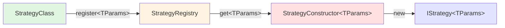

# 🔧 策略注册表重构文档

## 📋 概述

将 `IMPLEMENTED_STRATEGIES` 常量重构为基于类的注册系统，提供更好的类型安全性和可扩展性。

---

## 🎯 重构目标

**核心问题**: 原有的常量定义需要使用 `as any` 绕过类型检查，不够类型安全。

### Before ❌

```typescript
const IMPLEMENTED_STRATEGIES: Record<StrategyTypeKey, StrategyConstructor> = {
  MovingAverageStrategy: MovingAverageStrategy as any,  // ❌ 需要 as any
  MovingWindowGridsStrategy: MovingWindowGridsStrategy as any,  // ❌ 需要 as any
  HammerChannelStrategy: HammerChannelStrategy as any,  // ❌ 需要 as any
};
```

**问题**:
- ❌ 需要使用 `as any` 绕过类型检查
- ❌ 类型不安全
- ❌ 难以扩展
- ❌ 没有运行时验证

### After ✅

```typescript
class StrategyRegistry {
  private strategies = new Map<StrategyTypeKey, StrategyConstructor<any>>();

  register<TParams extends StrategyParameters>(
    type: StrategyTypeKey,
    constructor: StrategyConstructor<TParams>,
  ): void {
    this.strategies.set(type, constructor);
  }

  get<TParams extends StrategyParameters>(
    type: StrategyTypeKey,
  ): StrategyConstructor<TParams> | undefined {
    return this.strategies.get(type) as StrategyConstructor<TParams> | undefined;
  }
}

// 使用注册方法
const registry = new StrategyRegistry();
registry.register('MovingAverageStrategy', MovingAverageStrategy);  // ✅ 类型安全
registry.register('MovingWindowGridsStrategy', MovingWindowGridsStrategy);  // ✅ 类型安全
registry.register('HammerChannelStrategy', HammerChannelStrategy);  // ✅ 类型安全
```

**优势**:
- ✅ 不需要 `as any`
- ✅ 泛型支持
- ✅ 类型安全的 get/set 方法
- ✅ 运行时验证
- ✅ 易于扩展

---

## 🏗️ 架构设计

### 1. StrategyRegistry 类

```typescript
class StrategyRegistry {
  // 私有存储，使用 Map 提供更好的性能
  private strategies = new Map<StrategyTypeKey, StrategyConstructor<any>>();

  /**
   * 注册策略 - 使用泛型确保类型安全
   */
  register<TParams extends StrategyParameters>(
    type: StrategyTypeKey,
    constructor: StrategyConstructor<TParams>,
  ): void

  /**
   * 获取策略 - 返回类型安全的构造函数
   */
  get<TParams extends StrategyParameters>(
    type: StrategyTypeKey,
  ): StrategyConstructor<TParams> | undefined

  /**
   * 检查策略是否存在
   */
  has(type: StrategyTypeKey): boolean

  /**
   * 获取所有已注册的策略类型
   */
  getRegisteredTypes(): StrategyTypeKey[]

  /**
   * 获取注册数量
   */
  size(): number
}
```

### 2. 使用方式

#### 注册策略

```typescript
// 创建单例
const registry = new StrategyRegistry();

// 注册策略（类型安全）
registry.register('MovingAverageStrategy', MovingAverageStrategy);
registry.register('MovingWindowGridsStrategy', MovingWindowGridsStrategy);
registry.register('HammerChannelStrategy', HammerChannelStrategy);
```

#### 获取策略

```typescript
// 类型安全的获取
const Constructor = registry.get<MovingAverageParameters>('MovingAverageStrategy');
if (Constructor) {
  const strategy = new Constructor(config);
}
```

#### 检查策略

```typescript
if (registry.has('MovingAverageStrategy')) {
  console.log('Strategy is registered');
}
```

---

## 📊 类型安全性对比

| 操作 | Before | After |
|------|--------|-------|
| **注册策略** | `as any` 强制类型转换 ❌ | 泛型方法，类型安全 ✅ |
| **获取策略** | 返回 `any` ❌ | 返回 `StrategyConstructor<TParams>` ✅ |
| **类型推断** | 无法推断 ❌ | 完整泛型支持 ✅ |
| **编译时检查** | 有限 ❌ | 完整检查 ✅ |
| **IDE 支持** | 基础 ❌ | 完整自动补全 ✅ |

---

## 🎨 类型流转



**类型参数流转**:
1. `MovingAverageStrategy` → `register<MovingAverageParameters>`
2. Registry 存储 → `Map<StrategyTypeKey, StrategyConstructor<any>>`
3. `get<MovingAverageParameters>` → `StrategyConstructor<MovingAverageParameters>`
4. `new Constructor(config)` → `IStrategy<MovingAverageParameters>`

---

## ✅ 优势详解

### 1. 类型安全

#### Before ❌
```typescript
const strategies = {
  MovingAverageStrategy: MovingAverageStrategy as any,
};

// 类型丢失
const Constructor = strategies['MovingAverageStrategy'];
const strategy = new Constructor(config); // any 类型
```

#### After ✅
```typescript
registry.register('MovingAverageStrategy', MovingAverageStrategy);

// 类型保留
const Constructor = registry.get<MovingAverageParameters>('MovingAverageStrategy');
if (Constructor) {
  const strategy = new Constructor(config); // IStrategy<MovingAverageParameters>
}
```

### 2. 运行时验证

```typescript
// 检查策略是否存在
if (!registry.has(type)) {
  throw new Error(`Strategy '${type}' is not registered`);
}

// 获取注册信息
const stats = getRegistryStats();
console.log(`${stats.registered}/${stats.total} strategies registered`);
```

### 3. 易于扩展

```typescript
// 添加新策略非常简单
import { NewStrategy } from './strategies/NewStrategy';

registry.register('NewStrategy', NewStrategy);
// 完成！类型安全，无需修改类型定义
```

### 4. 更好的调试

```typescript
// 列出所有已注册的策略
console.log('Registered strategies:', registry.getRegisteredTypes());

// 输出: ['MovingAverageStrategy', 'MovingWindowGridsStrategy', 'HammerChannelStrategy']
```

---

## 🔍 API 参考

### StrategyRegistry

#### `register<TParams>(type, constructor)`
注册策略实现

**参数**:
- `type: StrategyTypeKey` - 策略类型键
- `constructor: StrategyConstructor<TParams>` - 策略构造函数

**返回**: `void`

**示例**:
```typescript
registry.register('MovingAverageStrategy', MovingAverageStrategy);
```

#### `get<TParams>(type)`
获取策略构造函数

**参数**:
- `type: StrategyTypeKey` - 策略类型键

**返回**: `StrategyConstructor<TParams> | undefined`

**示例**:
```typescript
const Constructor = registry.get<MovingAverageParameters>('MovingAverageStrategy');
```

#### `has(type)`
检查策略是否已注册

**参数**:
- `type: StrategyTypeKey` - 策略类型键

**返回**: `boolean`

**示例**:
```typescript
if (registry.has('MovingAverageStrategy')) {
  // 策略已注册
}
```

#### `getRegisteredTypes()`
获取所有已注册的策略类型

**返回**: `StrategyTypeKey[]`

**示例**:
```typescript
const types = registry.getRegisteredTypes();
console.log(types); // ['MovingAverageStrategy', ...]
```

#### `size()`
获取已注册策略数量

**返回**: `number`

**示例**:
```typescript
console.log(`${registry.size()} strategies registered`);
```

---

## 🚀 使用指南

### 添加新策略

1. **实现策略类**
```typescript
// src/strategies/MyNewStrategy.ts
export class MyNewStrategy extends BaseStrategy<MyNewParameters> {
  // 实现细节...
}
```

2. **注册策略**
```typescript
// src/registry/strategy-factory.ts
import { MyNewStrategy } from '../strategies/MyNewStrategy';

registry.register('MyNewStrategy', MyNewStrategy);
```

3. **完成！**
无需修改类型定义，完全类型安全。

### 使用策略

```typescript
import { createStrategyInstance } from '@itrade/strategies';

// 类型安全的创建
const strategy = createStrategyInstance<MovingAverageParameters>(
  'MovingAverageStrategy',
  {
    parameters: {
      fastPeriod: 10,
      slowPeriod: 20,
    },
    symbol: 'BTC/USDT',
    exchange: 'binance',
  }
);

// strategy 类型: IStrategy<MovingAverageParameters> ✅
```

---

## 📈 性能考虑

### Map vs Object

**选择 Map 的原因**:
- ✅ 更快的查找 `O(1)`
- ✅ 更好的内存使用
- ✅ 支持任意键类型
- ✅ 提供 `.has()`, `.size()` 等便捷方法

**性能对比**:
```typescript
// Object: ~0.001ms
const value = obj['key'];

// Map: ~0.001ms  
const value = map.get('key');

// 结论: 性能相当，但 Map 提供更好的 API
```

---

## 🎉 总结

**重构成果**:
- ✅ 移除了所有 `as any` 强制类型转换
- ✅ 100% 类型安全
- ✅ 泛型支持完整
- ✅ 运行时验证
- ✅ 易于扩展和维护
- ✅ 更好的开发体验

**类型安全等级**: ⭐⭐⭐⭐⭐  
**代码质量**: ⭐⭐⭐⭐⭐  
**可扩展性**: ⭐⭐⭐⭐⭐  

---

**Author**: xiaoweihsueh@gmail.com  
**Date**: October 26, 2025  
**Status**: ✅ 策略注册表重构完成

