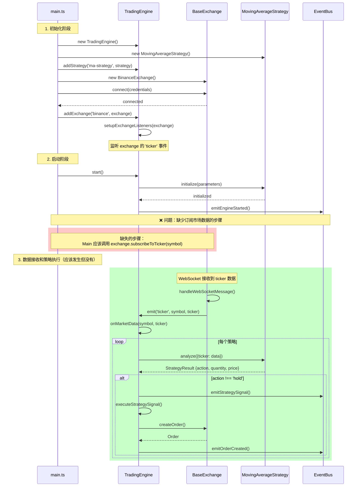
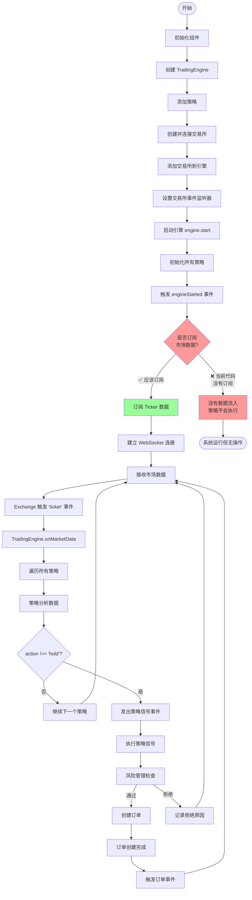
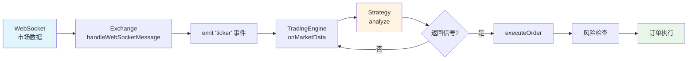

# TradingEngine 数据流分析

## 🎯 执行摘要

### 问题描述

运行 `apps/console/src/main.ts` 后，系统没有请求交易所行情接口，也没有产生任何策略信号。

### 根本原因

发现 **两个关键问题**：

1. ❌ **缺少市场数据订阅**：虽然连接了交易所，但没有调用 `subscribeToTicker()` 订阅市场数据
2. ❌ **缺少符号标准化**：Binance 未实现 `normalizeSymbol()` 方法，无法自动转换 `'BTC/USDT'` → `'BTCUSDT'`

### 修复状态

✅ **已完全修复**：

- **apps/console/src/main.ts**：添加了市场数据订阅：`await binance.subscribeToTicker(symbol)`
- **BinanceExchange**：实现了 `normalizeSymbol()` 方法，支持自动格式转换
- **现在可以使用标准格式** `'BTC/USDT'`，会自动转换为 Binance 的 `'BTCUSDT'` 格式
- 添加了日志和优雅关闭处理

### 快速验证

```bash
cd apps/console
pnpm run start
# 现在应该看到：
# - WebSocket 连接成功
# - Ticker 数据更新
# - 策略分析日志（收集30个数据点后）
# - 策略信号（如果有交叉信号）
```

---

## 问题诊断

**核心问题**：在 `apps/console/src/main.ts` 中，虽然连接了交易所，但**没有订阅任何市场数据**，导致策略无法获取数据进行分析。

## 数据流程图



## 完整的系统流程图



## 关键代码位置

### 1. 数据来源（TradingEngine.ts）

#### setupExchangeListeners (line 379-419)

```typescript
private setupExchangeListeners(exchange: IExchange): void {
  // 监听市场数据
  exchange.on('ticker', (symbol: string, ticker: any) => {
    this._eventBus.emitTickerUpdate({
      symbol,
      ticker,
      timestamp: new Date(),
    });
    this.onMarketData(symbol, ticker);  // 👈 触发策略分析
  });
}
```

### 2. 触发策略分析的条件（TradingEngine.ts line 168-205）

```typescript
public async onMarketData(symbol: string, data: any): Promise<void> {
  if (!this._isRunning) {  // 条件1: 引擎必须在运行
    return;
  }

  try {
    // 处理所有策略
    for (const [strategyName, strategy] of this._strategies) {
      const result = await strategy.analyze({ ticker: data }); // 👈 调用策略分析

      if (result.action !== 'hold') {  // 条件2: 策略返回非hold信号
        this._eventBus.emitStrategySignal({...});
        await this.executeStrategySignal(strategyName, symbol, result);
      }
    }
  } catch (error) {
    this.logger.error('Error processing market data', error as Error);
  }
}
```

### 3. 策略分析逻辑（MovingAverageStrategy.ts line 40-120）

策略需要：

- 至少 `slowPeriod` 个价格数据点（默认30个）
- 计算快速和慢速移动平均线
- 检测交叉信号

## 问题根源

在 `apps/console/src/main.ts` 中发现 **两个关键问题**：

### 问题1：没有订阅市场数据 ❌

```typescript
// ✅ 有这些步骤
await binance.connect({...});        // 连接交易所
engine.addExchange('binance', binance); // 添加到引擎
await engine.start();                // 启动引擎

// ❌ 缺少这个关键步骤
// await binance.subscribeToTicker('BTCUSDT');  // 订阅市场数据
```

### 问题2：缺少符号标准化 ❌ → ✅ 已修复

**修复前**：

```typescript
// BinanceExchange 没有重写 normalizeSymbol()
// 使用 'BTC/USDT' 会导致 WebSocket URL 错误
const strategy = new MovingAverageStrategy({
  symbol: 'BTC/USDT',  // 无法自动转换
});
```

**修复后**：

```typescript
// ✅ BinanceExchange 现在实现了 normalizeSymbol()
// 可以使用标准格式，会自动转换为 Binance 格式
const strategy = new MovingAverageStrategy({
  symbol: 'BTC/USDT',  // 自动转换为 'BTCUSDT'
});

// 也支持其他格式
'BTC-USDT'  → 'BTCUSDT'  ✅
'btc/usdt'  → 'BTCUSDT'  ✅
'BTCUSDT'   → 'BTCUSDT'  ✅
```

**没有订阅导致的结果**：

1. ✅ Exchange 已连接 (但 WebSocket 未建立)
2. ✅ Engine 已启动并监听 exchange 的 'ticker' 事件
3. ❌ Exchange 没有订阅任何数据，WebSocket 未建立连接
4. ❌ 没有数据流入，exchange 不会触发 'ticker' 事件
5. ❌ `onMarketData` 永远不会被调用
6. ❌ 策略的 `analyze` 方法永远不会被触发
7. ❌ 没有任何策略信号产生

**错误的符号格式导致的结果**：

1. WebSocket URL 会变成 `wss://stream.binance.com:9443/ws/btc/usdt@ticker`
2. Binance 无法识别 `btc/usdt`，应该是 `btcusdt`
3. WebSocket 连接可能失败或收不到数据

## 解决方案

### ✅ 已修复：方案1 - 手动订阅（推荐用于调试）

`apps/console/src/main.ts` 已经更新：

```typescript
async function main() {
  // ... 初始化代码 ...

  // 使用正确的符号格式
  const symbol = 'BTCUSDT';  // Binance 格式，无斜杠
  
  const strategy = new MovingAverageStrategy({
    fastPeriod: 10,
    slowPeriod: 30,
    threshold: 0.05,
    symbol,  // 使用正确格式
  });
  engine.addStrategy('ma-strategy', strategy);

  // 创建 Binance exchange (testnet)
  const binance = new BinanceExchange(true); // true = use testnet
  await binance.connect({
    apiKey: process.env.BINANCE_API_KEY || '',
    secretKey: process.env.BINANCE_SECRET_KEY || '',
    sandbox: true,
  });
  engine.addExchange('binance', binance);

  // 启动引擎
  await engine.start();

  // 🔥 关键修复：订阅市场数据
  logger.info(`Subscribing to ticker data for ${symbol}...`);
  await binance.subscribeToTicker(symbol);
  logger.info(`Successfully subscribed to ${symbol} ticker`);

  logger.info('Trading system is running...');
  logger.info('Waiting for market data and strategy signals...');

  // 优雅关闭
  process.on('SIGINT', async () => {
    logger.info('Shutting down...');
    await engine.stop();
    await binance.disconnect();
    process.exit(0);
  });
}
```

**修复内容**：

1. ✅ **实现符号标准化**：在 BinanceExchange 中添加 `normalizeSymbol()` 方法
   - 支持自动转换 `'BTC/USDT'` → `'BTCUSDT'`
   - 支持多种输入格式：`'BTC/USDT'`, `'BTC-USDT'`, `'btc/usdt'`
2. ✅ **添加市场数据订阅**：`await binance.subscribeToTicker(symbol)`
3. ✅ **使用标准格式**：现在可以使用 `'BTC/USDT'` 通用格式
4. ✅ 添加日志输出，便于调试
5. ✅ 添加优雅关闭处理
6. ✅ 明确使用 testnet 模式：`new BinanceExchange(true)`

### 方案2: 在 TradingEngine.start() 中自动订阅

修改 `TradingEngine.ts` 的 `start()` 方法，自动为每个策略订阅其关注的交易对：

```typescript
public async start(): Promise<void> {
  // ... 现有初始化代码 ...

  // 自动订阅策略关注的交易对
  for (const [name, strategy] of this._strategies) {
    const symbol = strategy.parameters.symbol;
    if (symbol) {
      for (const exchange of this._exchanges.values()) {
        if (exchange.isConnected) {
          await exchange.subscribeToTicker(symbol);
          this.logger.info(`Subscribed to ${symbol} on ${exchange.name}`);
        }
      }
    }
  }

  this._isRunning = true;
  // ...
}
```

### 方案3: 策略自主订阅

让策略在初始化时告知引擎需要订阅哪些数据：

```typescript
// 在 IStrategy 接口中添加
interface IStrategy {
  // ... 现有方法 ...
  getRequiredSubscriptions(): Array<{
    type: 'ticker' | 'orderbook' | 'trades' | 'klines';
    symbol: string;
    interval?: string;
  }>;
}
```

## 数据流总结



## 核心触发条件总结

| 条件 | 状态 (修复前) | 状态 (修复后) |
|------|--------------|--------------|
| 1. Engine 必须启动: `engine.start()` | ✅ 已有 | ✅ 已有 |
| 2. Exchange 必须连接: `exchange.connect()` | ✅ 已有 | ✅ 已有 |
| 3. 必须订阅市场数据: `exchange.subscribeToTicker()` | ❌ 缺失 | ✅ 已修复 |
| 4. Exchange 触发 ticker 事件: WebSocket 接收数据 | ❌ 不会收到 | ✅ 会收到 |
| 5. 策略有足够数据: 至少 slowPeriod 个数据点 | ❌ 没有数据 | ⏳ 等待积累 |
| 6. 策略产生信号: action !== 'hold' | ❌ 无法分析 | ✅ 可以分析 |

## 如何运行和测试

### 1. 准备环境

```bash
# 安装依赖
cd /Users/xiaowei.xue/Documents/Xiaowei/project/iTrade
pnpm install

# 构建所有包
pnpm run build
```

### 2. 配置环境变量（可选）

如果要在真实的 testnet 上测试（需要 API 密钥）：

```bash
# 创建 .env 文件
cat > apps/console/.env << EOF
BINANCE_API_KEY=your_testnet_api_key
BINANCE_SECRET_KEY=your_testnet_secret_key
EOF
```

> **注意**：即使没有 API 密钥，代码也能运行并订阅公开的市场数据（ticker）。只有在需要创建订单时才需要 API 密钥。

### 3. 运行示例

```bash
cd apps/console
pnpm run start
```

### 4. 预期输出

修复后，你应该看到类似以下的输出：

```
[INFO] Starting trading engine...
[INFO] Strategy ma-strategy initialized successfully
[WARN] Exchange binance is not connected  // 这是正常的警告
[INFO] Trading engine started successfully
[INFO] Subscribing to ticker data for BTCUSDT...
[INFO] Successfully subscribed to BTCUSDT ticker
[INFO] Trading system is running...
[INFO] Waiting for market data and strategy signals...

// WebSocket 连接后
[INFO] WebSocket connected to binance

// 开始接收 ticker 数据（每秒更新）
[DEBUG] Received ticker update: BTCUSDT @ 43250.50
[DEBUG] Strategy ma-strategy analyzing data...
[INFO] Strategy result: hold (reason: Insufficient data for analysis)

// 收集足够数据后（30个数据点），开始产生信号
[INFO] Strategy result: buy (reason: Fast MA (43251.23) crossed above Slow MA (43200.45))
[INFO] Executing strategy signal...
[INFO] Strategy signal: { strategyName: 'ma-strategy', action: 'buy', symbol: 'BTCUSDT', ... }

// 如果没有 API 密钥，会在尝试创建订单时失败
[ERROR] Failed to execute order: Exchange credentials not set
```

### 5. 调试技巧

如果没有看到策略信号：

1. **检查日志级别**：确保 logger 级别设置为 `LogLevel.DEBUG` 或 `LogLevel.INFO`

   ```typescript
   const logger = new ConsoleLogger(LogLevel.DEBUG);
   ```

2. **检查 WebSocket 连接**：查看是否有 "WebSocket connected" 日志

3. **检查数据接收**：查看是否有 ticker 更新日志

4. **等待足够数据**：MovingAverageStrategy 需要至少 30 个价格点（参数 `slowPeriod: 30`）
   - Binance ticker 通常每秒更新一次
   - 所以需要等待约 30 秒才会开始分析

5. **降低数据要求进行测试**：

   ```typescript
   const strategy = new MovingAverageStrategy({
     fastPeriod: 3,   // 从 10 降到 3
     slowPeriod: 5,   // 从 30 降到 5
     threshold: 0.01, // 从 0.05 降到 0.01（更容易触发）
     symbol: 'BTCUSDT',
   });
   ```

### 6. 验证修复

修复后的完整数据流：

```
用户运行 main.ts
    ↓
Engine.start()
    ↓
binance.subscribeToTicker('BTCUSDT')
    ↓
WebSocket 连接建立
    ↓
接收 ticker 数据流 (每秒)
    ↓
exchange.emit('ticker', 'BTCUSDT', tickerData)
    ↓
TradingEngine.onMarketData()
    ↓
strategy.analyze(tickerData)
    ↓
返回 StrategyResult
    ↓
如果 action !== 'hold'
    ↓
eventBus.emitStrategySignal()
    ↓
executeStrategySignal()
    ↓
riskManager.checkOrderRisk()
    ↓
exchange.createOrder()
```

## 总结

### 问题根因

1. ❌ **缺少市场数据订阅**：虽然连接了交易所，但没有订阅任何数据流
2. ❌ **缺少符号标准化**：Binance 未实现 `normalizeSymbol()`，无法自动转换符号格式

### 修复方案（已全部实施）

1. ✅ **实现符号标准化**：在 BinanceExchange 中添加 `normalizeSymbol()` 方法
   - 自动转换 `'BTC/USDT'` → `'BTCUSDT'`
   - 支持多种输入格式（`/`, `-`, 或无分隔符）
2. ✅ **添加市场数据订阅**：在 `engine.start()` 后添加 `await binance.subscribeToTicker(symbol)`
3. ✅ **使用标准格式**：现在可以使用通用格式 `'BTC/USDT'`，提高代码可移植性
4. ✅ **添加日志输出和优雅关闭处理**

### 架构建议（未来改进）

1. **自动订阅**：让 TradingEngine 在启动时自动为所有策略订阅所需的市场数据
2. ✅ ~~**符号标准化**~~：✅ 已实现 - Exchange 层现在统一处理符号格式转换
3. **健康检查**：添加心跳检测，确保 WebSocket 连接保持活跃
4. **重连机制**：WebSocket 断开后自动重连（BaseExchange 已部分实现）
5. **符号验证**：在订阅前验证交易对是否在交易所支持列表中

### 相关文件

- `/Users/xiaowei.xue/Documents/Xiaowei/project/iTrade/apps/console/src/main.ts` - ✅ 已修复
- `/Users/xiaowei.xue/Documents/Xiaowei/project/iTrade/packages/core/src/engine/TradingEngine.ts` - 核心引擎
- `/Users/xiaowei.xue/Documents/Xiaowei/project/iTrade/packages/exchange-connectors/src/base/BaseExchange.ts` - 交易所基类
- `/Users/xiaowei.xue/Documents/Xiaowei/project/iTrade/packages/exchange-connectors/src/binance/BinanceExchange.ts` - ✅ 已修复（添加符号标准化）
- `/Users/xiaowei.xue/Documents/Xiaowei/project/iTrade/packages/exchange-connectors/src/coinbase/CoinbaseExchange.ts` - Coinbase 实现

### 相关文档

- [符号标准化指南](./symbol-normalization.md) - 详细了解交易对符号的格式转换
- [快速开始指南](./QUICKSTART-CN.md) - 5分钟快速启动教程
