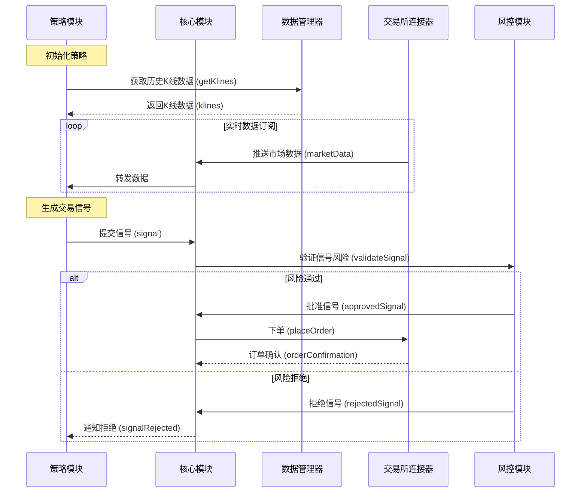

# 自定义策略示例

## 完整的交易系统示例

以下是一个完整的交易系统示例，展示如何初始化所有组件并运行自定义策略：

```typescript
import { TradingEngine, LogLevel, BaseStrategy, StrategyResult, EventBus, EVENTS } from '@itrade/core';
import { ConsoleLogger } from '@itrade/logger';
import { RiskManager } from '@itrade/risk-manager';
import { PortfolioManager } from '@itrade/portfolio-manager';
import { BinanceExchange } from '@itrade/exchange-connectors';
import { DataManager } from '@itrade/data-manager';
import { Decimal } from 'decimal.js';

// 1. 初始化核心组件
const logger = new ConsoleLogger(LogLevel.INFO);

const riskManager = new RiskManager({
  maxDrawdown: new Decimal(20),        // 最大回撤 20%
  maxPositionSize: new Decimal(10),    // 最大仓位 10%
  maxDailyLoss: new Decimal(5),        // 最大日损失 5%
  maxLeverage: new Decimal(1),         // 不使用杠杆
});

const portfolioManager = new PortfolioManager(new Decimal(10000)); // 初始资金 $10,000

const engine = new TradingEngine(riskManager, portfolioManager, logger);

// 2. 创建自定义策略
class CustomMovingAverageStrategy extends BaseStrategy {
  private shortMA: Decimal[] = [];
  private longMA: Decimal[] = [];
  
  constructor(parameters: any) {
    super('CustomMA', parameters);
  }
  
  protected async onInitialize(): Promise<void> {
    this.validateParameters(['fastPeriod', 'slowPeriod', 'threshold']);
    logger.info(`初始化策略: ${this.name}`);
  }
  
  public async analyze(marketData: any): Promise<StrategyResult> {
    const { klines } = marketData;
    
    if (!klines || klines.length < this.getParameter('slowPeriod')) {
      return { action: 'hold', reason: '数据不足' };
    }
    
    // 计算移动平均线
    const fastPeriod = this.getParameter('fastPeriod');
    const slowPeriod = this.getParameter('slowPeriod');
    
    const closes = klines.map((k: any) => k.close);
    const shortMA = this.calculateMA(closes, fastPeriod);
    const longMA = this.calculateMA(closes, slowPeriod);
    
    const lastShortMA = shortMA[shortMA.length - 1];
    const lastLongMA = longMA[longMA.length - 1];
    const prevShortMA = shortMA[shortMA.length - 2];
    const prevLongMA = longMA[longMA.length - 2];
    
    // 金叉：买入信号
    if (prevShortMA.lte(prevLongMA) && lastShortMA.gt(lastLongMA)) {
      return {
        action: 'buy',
        quantity: new Decimal(0.01),
        price: klines[klines.length - 1].close,
        confidence: 0.8,
        reason: `金叉信号: 快线${lastShortMA.toFixed(2)} > 慢线${lastLongMA.toFixed(2)}`,
      };
    }
    
    // 死叉：卖出信号
    if (prevShortMA.gte(prevLongMA) && lastShortMA.lt(lastLongMA)) {
      return {
        action: 'sell',
        quantity: new Decimal(0.01),
        price: klines[klines.length - 1].close,
        confidence: 0.8,
        reason: `死叉信号: 快线${lastShortMA.toFixed(2)} < 慢线${lastLongMA.toFixed(2)}`,
      };
    }
    
    return { action: 'hold', reason: '无交易信号' };
  }
  
  private calculateMA(data: Decimal[], period: number): Decimal[] {
    const ma: Decimal[] = [];
    for (let i = period - 1; i < data.length; i++) {
      const sum = data.slice(i - period + 1, i + 1)
        .reduce((a, b) => a.add(b), new Decimal(0));
      ma.push(sum.div(period));
    }
    return ma;
  }
  
  public async cleanup(): Promise<void> {
    logger.info(`清理策略: ${this.name}`);
  }
}

// 3. 配置交易所
const binance = new BinanceExchange();
await binance.connect({
  apiKey: process.env.BINANCE_API_KEY || '',
  secretKey: process.env.BINANCE_SECRET_KEY || '',
  sandbox: true, // 使用测试网
});

engine.addExchange('binance', binance);

// 4. 添加策略
const strategy = new CustomMovingAverageStrategy({
  fastPeriod: 5,
  slowPeriod: 20,
  threshold: 0.001,  // 0.1% 最小交叉阈值
});

engine.addStrategy('custom-ma', strategy);

// 5. 监听事件
const eventBus = EventBus.getInstance();

eventBus.onStrategySignal((signal) => {
  logger.info(`策略信号: ${signal.strategyName} - ${signal.action}`, signal);
});

eventBus.onOrderFilled((order) => {
  logger.info(`订单成交: ${order.orderId}`, {
    symbol: order.symbol,
    side: order.side,
    quantity: order.executedQuantity?.toString(),
    price: order.price?.toString(),
  });
});

eventBus.onRiskLimitExceeded((alert) => {
  logger.warn(`风险警告: ${alert.message}`, alert);
});

// 6. 启动交易引擎
await engine.start();

logger.info('交易系统已启动，开始监控市场...');

// 7. 定时获取市场数据并分析（每5分钟）
setInterval(async () => {
  try {
    const symbol = 'BTCUSDT';
    const ticker = await binance.getTicker(symbol);
    const dataManager = new DataManager(/* 配置 */);
    const klines = await dataManager.getKlines(
      symbol,
      '1h',
      new Date(Date.now() - 24 * 60 * 60 * 1000),
      new Date()
    );
    
    // 分析市场数据
    await engine.onMarketData(symbol, { ticker, klines });
  } catch (error) {
    logger.error('市场数据处理错误', error as Error);
  }
}, 5 * 60 * 1000);

// 优雅关闭
process.on('SIGINT', async () => {
  logger.info('正在关闭交易系统...');
  await engine.stop();
  process.exit(0);
});
```

## 时序图
