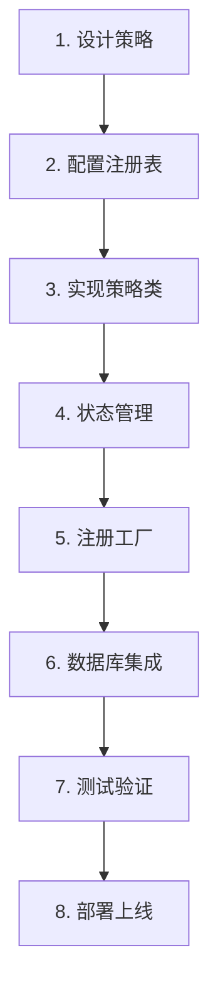

# 🚀 策略开发完整指南

## 📋 概述

本指南将详细说明如何从零开始创建一个新的交易策略，并将其完整集成到iTrade系统中，支持状态恢复和持久化。

## 🎯 开发流程概览



## 📝 第一步：策略设计和规划

### 1.1 定义策略需求

在开始编码前，明确以下问题：

```typescript
// 策略基本信息
interface StrategySpec {
  name: string;                    // 策略名称
  description: string;             // 策略描述
  category: 'trend' | 'momentum' | 'volatility' | 'arbitrage';
  
  // 输入参数
  parameters: {
    [key: string]: {
      type: 'number' | 'string' | 'boolean';
      defaultValue: any;
      min?: number;
      max?: number;
      required: boolean;
      description: string;
    };
  };
  
  // 数据需求
  dataRequirements: {
    ticker: boolean;
    klines: boolean;
    orderbook: boolean;
    trades: boolean;
  };
  
  // 状态需求
  stateRequirements: {
    needsHistory: boolean;          // 是否需要历史数据
    historyLength?: number;         // 历史数据长度
    indicators: string[];           // 需要的技术指标
  };
}
```

### 1.2 示例：RSI策略规划

```typescript
const rsiStrategySpec: StrategySpec = {
  name: 'RSI Oscillator Strategy',
  description: 'RSI-based overbought/oversold trading strategy',
  category: 'momentum',
  
  parameters: {
    period: {
      type: 'number',
      defaultValue: 14,
      min: 2,
      max: 50,
      required: true,
      description: 'RSI calculation period'
    },
    overboughtLevel: {
      type: 'number', 
      defaultValue: 70,
      min: 50,
      max: 95,
      required: true,
      description: 'RSI overbought threshold for sell signal'
    },
    oversoldLevel: {
      type: 'number',
      defaultValue: 30, 
      min: 5,
      max: 50,
      required: true,
      description: 'RSI oversold threshold for buy signal'
    }
  },
  
  dataRequirements: {
    ticker: true,
    klines: true,
    orderbook: false,
    trades: false
  },
  
  stateRequirements: {
    needsHistory: true,
    historyLength: 100,
    indicators: ['RSI', 'PriceHistory']
  }
};
```

## 📊 第二步：配置策略注册表

### 2.1 添加策略类型

**文件**: `packages/core/src/config/strategy-registry.ts`

```typescript
// 1. 更新策略类型枚举
export type StrategyTypeKey = 
  | 'moving_average' 
  | 'rsi'              // 🆕 添加新策略类型
  | 'macd' 
  | 'bollinger_bands' 
  | 'custom';

// 2. 添加策略配置
export const STRATEGY_REGISTRY: Record<StrategyTypeKey, StrategyConfig> = {
  // ... 现有策略配置
  
  rsi: {
    type: 'rsi',
    name: 'RSI Oscillator Strategy',
    icon: '📊',
    description: 'RSI-based momentum strategy for overbought/oversold conditions',
    category: 'momentum',
    implemented: false, // 🔄 实际实现状态由 @itrade/strategies 包动态确定
    
    defaultParameters: {
      period: 14,
      overboughtLevel: 70,
      oversoldLevel: 30,
      subscription: {
        ticker: true,
        klines: true,
        method: 'rest',
      },
    },
    
    parameterDefinitions: [
      {
        name: 'period',
        type: 'number',
        description: 'RSI calculation period (number of candles)',
        defaultValue: 14,
        required: true,
        min: 2,
        max: 50,
      },
      {
        name: 'overboughtLevel', 
        type: 'number',
        description: 'RSI level considered overbought (sell signal)',
        defaultValue: 70,
        required: true,
        min: 50,
        max: 95,
      },
      {
        name: 'oversoldLevel',
        type: 'number', 
        description: 'RSI level considered oversold (buy signal)',
        defaultValue: 30,
        required: true,
        min: 5,
        max: 50,
      },
    ],
    
    documentation: {
      overview: 'Uses RSI oscillator to identify overbought and oversold market conditions. Generates buy signals when RSI drops below oversold level and sell signals when RSI rises above overbought level.',
      parameters: 'Period controls RSI sensitivity - lower values are more sensitive. Overbought/oversold levels should be symmetric around 50.',
      signals: 'BUY: RSI < oversoldLevel. SELL: RSI > overboughtLevel. HOLD: RSI between levels.',
      riskFactors: [
        'RSI can remain overbought/oversold for extended periods during strong trends',
        'May generate false signals in ranging markets',
        'Lagging indicator - signals may come after significant price moves'
      ]
    }
  },
};
```

### 2.2 更新数据库枚举

**文件**: `packages/data-manager/src/entities/Strategy.ts`

```typescript
export enum StrategyType {
  MOVING_AVERAGE = 'moving_average',
  RSI = 'rsi',                    // 🆕 添加新枚举值
  MACD = 'macd', 
  BOLLINGER_BANDS = 'bollinger_bands',
  CUSTOM = 'custom',
}
```

## 🏗️ 第三步：实现策略类

### 3.1 创建策略文件

**文件**: `packages/strategies/src/strategies/RSIStrategy.ts`

```typescript
import { Decimal } from 'decimal.js';
import {
  BaseStrategy,
  StrategyResult,
  StrategyParameters,
  Ticker,
  Kline,
  StrategyStateSnapshot,
  StrategyRecoveryContext,
} from '@itrade/core';

// 🔧 策略参数接口
export interface RSIParameters extends StrategyParameters {
  period: number;
  overboughtLevel: number;
  oversoldLevel: number;
}

// 🔧 RSI计算状态
interface RSIState {
  rsiValue: number;
  priceHistory: Decimal[];
  gains: number[];
  losses: number[];
  avgGain: number;
  avgLoss: number;
}

export class RSIStrategy extends BaseStrategy {
  // 🔧 策略特有属性
  private rsiState: RSIState;
  private readonly stateVersion = '1.0.0';

  constructor(parameters: RSIParameters) {
    super('RSIStrategy', parameters);
    
    // 初始化RSI状态
    this.rsiState = {
      rsiValue: 50, // 中性值
      priceHistory: [],
      gains: [],
      losses: [],
      avgGain: 0,
      avgLoss: 0,
    };
  }

  // 🔧 策略初始化
  protected async onInitialize(): Promise<void> {
    this.validateParameters(['period', 'overboughtLevel', 'oversoldLevel']);
    
    const period = this.getParameter<number>('period');
    const overbought = this.getParameter<number>('overboughtLevel');
    const oversold = this.getParameter<number>('oversoldLevel');
    
    // 参数验证
    if (period < 2) throw new Error('Period must be at least 2');
    if (overbought <= oversold) throw new Error('Overbought level must be higher than oversold level');
    if (overbought <= 50 || oversold >= 50) throw new Error('Overbought must be >50, oversold must be <50');
    
    // 如果有恢复的状态，跳过历史数据获取
    if (this.rsiState.priceHistory.length === 0) {
      // TODO: 从交易所获取历史K线数据来预热RSI计算
      // await this.fetchHistoricalData();
    }
    
    this.emit('rsiInitialized', { period, overbought, oversold });
  }

  // 🎯 核心分析逻辑
  public async analyze(marketData: {
    ticker?: Ticker;
    klines?: Kline[];
  }): Promise<StrategyResult> {
    this.ensureInitialized();

    // 获取当前价格
    let currentPrice: Decimal;
    if (marketData.ticker) {
      currentPrice = marketData.ticker.price;
    } else if (marketData.klines && marketData.klines.length > 0) {
      const latestKline = marketData.klines[marketData.klines.length - 1];
      currentPrice = latestKline.close;
    } else {
      return { action: 'hold', reason: 'No price data available' };
    }

    // 更新RSI计算
    this.updateRSI(currentPrice);
    
    // 生成交易信号
    const signal = this.generateSignal();
    
    // 🔥 记录信号和状态
    if (signal.action !== 'hold') {
      this.recordSignal(signal.action);
    }
    
    // 发出分析事件
    this.emit('analysisCompleted', {
      price: currentPrice.toString(),
      rsi: this.rsiState.rsiValue,
      signal: signal.action,
    });

    return signal;
  }

  // 🔧 RSI计算更新
  private updateRSI(currentPrice: Decimal): void {
    const period = this.getParameter<number>('period');
    
    // 添加到价格历史
    this.rsiState.priceHistory.push(currentPrice);
    
    // 保留所需的历史长度 + buffer
    const maxHistory = period + 10;
    if (this.rsiState.priceHistory.length > maxHistory) {
      this.rsiState.priceHistory = this.rsiState.priceHistory.slice(-maxHistory);
    }
    
    // 需要至少2个价格点来计算变化
    if (this.rsiState.priceHistory.length < 2) {
      return;
    }
    
    // 计算价格变化
    const prevPrice = this.rsiState.priceHistory[this.rsiState.priceHistory.length - 2];
    const change = currentPrice.minus(prevPrice).toNumber();
    
    // 分类增益和损失
    const gain = change > 0 ? change : 0;
    const loss = change < 0 ? Math.abs(change) : 0;
    
    this.rsiState.gains.push(gain);
    this.rsiState.losses.push(loss);
    
    // 保持期间长度
    if (this.rsiState.gains.length > period) {
      this.rsiState.gains.shift();
      this.rsiState.losses.shift();
    }
    
    // 计算RSI（需要足够的数据）
    if (this.rsiState.gains.length >= period) {
      this.calculateRSI(period);
    }
  }

  // 🔧 RSI计算
  private calculateRSI(period: number): void {
    // 计算平均增益和损失
    const sumGains = this.rsiState.gains.reduce((sum, gain) => sum + gain, 0);
    const sumLosses = this.rsiState.losses.reduce((sum, loss) => sum + loss, 0);
    
    this.rsiState.avgGain = sumGains / period;
    this.rsiState.avgLoss = sumLosses / period;
    
    // 避免除零错误
    if (this.rsiState.avgLoss === 0) {
      this.rsiState.rsiValue = 100;
      return;
    }
    
    // RSI公式: RSI = 100 - (100 / (1 + RS))
    // RS = 平均增益 / 平均损失
    const rs = this.rsiState.avgGain / this.rsiState.avgLoss;
    this.rsiState.rsiValue = 100 - (100 / (1 + rs));
  }

  // 🎯 信号生成
  private generateSignal(): StrategyResult {
    const overbought = this.getParameter<number>('overboughtLevel');
    const oversold = this.getParameter<number>('oversoldLevel');
    const rsi = this.rsiState.rsiValue;
    
    // 需要足够数据才能生成信号
    const period = this.getParameter<number>('period');
    if (this.rsiState.gains.length < period) {
      return { 
        action: 'hold', 
        reason: `Insufficient data for RSI calculation (${this.rsiState.gains.length}/${period})` 
      };
    }
    
    // 生成交易信号
    if (rsi < oversold) {
      const confidence = Math.min((oversold - rsi) / 10, 1); // 越远离阈值置信度越高
      return {
        action: 'buy',
        reason: `RSI oversold: ${rsi.toFixed(2)} < ${oversold}`,
        confidence,
        metadata: { rsi, overbought, oversold }
      };
    } else if (rsi > overbought) {
      const confidence = Math.min((rsi - overbought) / 10, 1);
      return {
        action: 'sell',
        reason: `RSI overbought: ${rsi.toFixed(2)} > ${overbought}`,
        confidence,
        metadata: { rsi, overbought, oversold }
      };
    }
    
    return { 
      action: 'hold', 
      reason: `RSI neutral: ${rsi.toFixed(2)} (${oversold} < RSI < ${overbought})`,
      metadata: { rsi, overbought, oversold }
    };
  }

  // 🔥 状态管理实现

  protected async getIndicatorData(): Promise<Record<string, unknown>> {
    return {
      rsiValue: this.rsiState.rsiValue,
      priceHistory: this.rsiState.priceHistory.map(p => p.toString()),
      gains: this.rsiState.gains,
      losses: this.rsiState.losses,
      avgGain: this.rsiState.avgGain,
      avgLoss: this.rsiState.avgLoss,
      historyLength: this.rsiState.priceHistory.length,
    };
  }

  protected async setIndicatorData(data: Record<string, unknown>): Promise<void> {
    if (data.rsiValue !== undefined) {
      this.rsiState.rsiValue = data.rsiValue as number;
    }
    
    if (data.priceHistory && Array.isArray(data.priceHistory)) {
      this.rsiState.priceHistory = (data.priceHistory as string[])
        .map(p => new Decimal(p));
    }
    
    if (data.gains && Array.isArray(data.gains)) {
      this.rsiState.gains = data.gains as number[];
    }
    
    if (data.losses && Array.isArray(data.losses)) {
      this.rsiState.losses = data.losses as number[];
    }
    
    if (data.avgGain !== undefined) {
      this.rsiState.avgGain = data.avgGain as number;
    }
    
    if (data.avgLoss !== undefined) {
      this.rsiState.avgLoss = data.avgLoss as number;
    }
    
    this.emit('indicatorDataRestored', { 
      rsiValue: this.rsiState.rsiValue,
      historyLength: this.rsiState.priceHistory.length 
    });
  }

  protected async onRecoveryContextSet(context: StrategyRecoveryContext): Promise<void> {
    // 处理恢复上下文，如未完成的订单等
    if (context.openOrders.length > 0) {
      this.emit('openOrdersDetected', { 
        count: context.openOrders.length,
        orders: context.openOrders 
      });
    }
    
    // 重新计算当前持仓（如果有的话）
    if (context.totalPosition && context.totalPosition !== '0') {
      const position = new Decimal(context.totalPosition);
      this.updatePosition(position);
      
      this.emit('positionRecovered', { 
        position: position.toString(),
        strategyId: context.strategyId 
      });
    }
  }

  // 🔧 公共方法：获取RSI值（用于监控）
  public getCurrentRSI(): number {
    return this.rsiState.rsiValue;
  }

  // 🔧 公共方法：获取RSI状态（用于调试）
  public getRSIState(): Readonly<RSIState> {
    return { ...this.rsiState };
  }
}
```

## 🔗 第四步：注册策略工厂

### 4.1 添加到实现映射

**文件**: `packages/strategies/src/registry/strategy-factory.ts`

```typescript
import { RSIStrategy } from '../strategies/RSIStrategy';

export const IMPLEMENTED_STRATEGIES: Partial<Record<StrategyTypeKey, StrategyConstructor>> = {
  moving_average: MovingAverageStrategy,
  custom: MovingAverageStrategy,
  rsi: RSIStrategy,              // 🆕 注册RSI策略
  
  // 🚧 待实现的策略
  // macd: MACDStrategy,
  // bollinger_bands: BollingerBandsStrategy,
};
```

### 4.2 导出策略类

**文件**: `packages/strategies/src/index.ts`

```typescript
// Strategies
export { MovingAverageStrategy } from './strategies/MovingAverageStrategy';
export type { MovingAverageParameters } from './strategies/MovingAverageStrategy';
export { RSIStrategy } from './strategies/RSIStrategy';           // 🆕 导出RSI策略
export type { RSIParameters } from './strategies/RSIStrategy';   // 🆕 导出参数类型

// ... 其他导出
```

## 💾 第五步：数据库集成

### 5.1 创建策略状态表（如果还没有）

```sql
-- 创建策略状态表
CREATE TABLE IF NOT EXISTS strategy_states (
    id SERIAL PRIMARY KEY,
    strategy_id INTEGER NOT NULL REFERENCES strategies(id) ON DELETE CASCADE,
    internal_state JSONB NOT NULL DEFAULT '{}',
    indicator_data JSONB NOT NULL DEFAULT '{}',
    last_signal VARCHAR(20),
    signal_time TIMESTAMP,
    current_position DECIMAL(28,10) NOT NULL DEFAULT 0,
    average_price DECIMAL(28,10),
    created_at TIMESTAMP DEFAULT CURRENT_TIMESTAMP,
    updated_at TIMESTAMP DEFAULT CURRENT_TIMESTAMP,
    
    UNIQUE(strategy_id)
);

-- 创建索引
CREATE INDEX IF NOT EXISTS idx_strategy_states_strategy_id ON strategy_states(strategy_id);
CREATE INDEX IF NOT EXISTS idx_strategy_states_updated_at ON strategy_states(updated_at);
```

### 5.2 更新数据管理器

**文件**: `packages/data-manager/src/TypeOrmDataManager.ts`

添加策略状态管理方法（如果还没有）：

```typescript
// 保存策略状态
async saveStrategyState(strategyId: number, state: Partial<StrategyState>): Promise<void> {
  const repo = this.dataSource.getRepository(StrategyStateEntity);
  await repo.upsert(
    { strategyId, ...state },
    { conflictPaths: ['strategyId'] }
  );
}

// 获取策略状态
async getStrategyState(strategyId: number): Promise<StrategyState | null> {
  const repo = this.dataSource.getRepository(StrategyStateEntity);
  return await repo.findOne({ where: { strategyId } });
}
```

## 🧪 第六步：测试和验证

### 6.1 单元测试

**文件**: `packages/strategies/src/strategies/__tests__/RSIStrategy.test.ts`

```typescript
import { Decimal } from 'decimal.js';
import { RSIStrategy, RSIParameters } from '../RSIStrategy';

describe('RSIStrategy', () => {
  let strategy: RSIStrategy;
  let defaultParams: RSIParameters;

  beforeEach(() => {
    defaultParams = {
      period: 14,
      overboughtLevel: 70,
      oversoldLevel: 30,
      subscription: {
        ticker: true,
        klines: true,
        method: 'rest',
      },
    };
    
    strategy = new RSIStrategy(defaultParams);
  });

  describe('initialization', () => {
    it('should initialize with correct parameters', async () => {
      await strategy.initialize(defaultParams);
      
      expect(strategy.getParameter('period')).toBe(14);
      expect(strategy.getParameter('overboughtLevel')).toBe(70);
      expect(strategy.getParameter('oversoldLevel')).toBe(30);
    });

    it('should throw error for invalid parameters', async () => {
      const invalidParams = { ...defaultParams, period: 1 };
      const invalidStrategy = new RSIStrategy(invalidParams);
      
      await expect(invalidStrategy.initialize(invalidParams))
        .rejects.toThrow('Period must be at least 2');
    });
  });

  describe('signal generation', () => {
    beforeEach(async () => {
      await strategy.initialize(defaultParams);
    });

    it('should generate hold signal with insufficient data', async () => {
      const result = await strategy.analyze({
        ticker: { price: new Decimal('50000') }
      });
      
      expect(result.action).toBe('hold');
      expect(result.reason).toContain('Insufficient data');
    });

    it('should generate buy signal when RSI is oversold', async () => {
      // 模拟价格下跌趋势来产生低RSI
      const prices = [100, 98, 96, 94, 92, 90, 88, 86, 84, 82, 80, 78, 76, 74, 72];
      
      for (const price of prices) {
        await strategy.analyze({
          ticker: { price: new Decimal(price) }
        });
      }
      
      const rsi = strategy.getCurrentRSI();
      expect(rsi).toBeLessThan(30); // 应该触发超卖
      
      const result = await strategy.analyze({
        ticker: { price: new Decimal('70') }
      });
      
      expect(result.action).toBe('buy');
      expect(result.reason).toContain('oversold');
    });
  });

  describe('state management', () => {
    beforeEach(async () => {
      await strategy.initialize(defaultParams);
    });

    it('should save and restore state correctly', async () => {
      // 产生一些数据
      await strategy.analyze({ ticker: { price: new Decimal('100') } });
      await strategy.analyze({ ticker: { price: new Decimal('105') } });
      
      // 保存状态
      const snapshot = await strategy.saveState();
      
      expect(snapshot.indicatorData).toHaveProperty('rsiValue');
      expect(snapshot.indicatorData).toHaveProperty('priceHistory');
      
      // 创建新策略实例并恢复状态
      const newStrategy = new RSIStrategy(defaultParams);
      await newStrategy.initialize(defaultParams);
      await newStrategy.restoreState(snapshot);
      
      // 验证状态已恢复
      expect(newStrategy.getCurrentRSI()).toBe(strategy.getCurrentRSI());
    });
  });
});
```

### 6.2 集成测试

**文件**: `test-rsi-integration.js`

```javascript
#!/usr/bin/env node

const { RSIStrategy } = require('@itrade/strategies');
const { Decimal } = require('decimal.js');

async function testRSIIntegration() {
  console.log('🧪 Testing RSI Strategy Integration...');

  // 1. 创建策略实例
  const strategy = new RSIStrategy({
    period: 14,
    overboughtLevel: 70,
    oversoldLevel: 30,
    subscription: { ticker: true, klines: true, method: 'rest' }
  });

  // 2. 初始化
  await strategy.initialize(strategy.parameters);
  console.log('✅ Strategy initialized');

  // 3. 模拟价格数据
  const prices = [
    100, 102, 101, 103, 105, 107, 106, 108, 110, 112,
    111, 109, 107, 105, 103, 101, 99, 97, 95, 93,
    91, 89, 87, 85, 83, 81, 79, 77, 75, 73
  ];

  let signals = [];
  
  for (const price of prices) {
    const result = await strategy.analyze({
      ticker: { price: new Decimal(price) }
    });
    
    if (result.action !== 'hold') {
      signals.push({
        price,
        action: result.action,
        rsi: strategy.getCurrentRSI(),
        reason: result.reason
      });
    }
  }

  // 4. 验证信号
  console.log('📊 Generated signals:', signals.length);
  signals.forEach(signal => {
    console.log(`${signal.action.toUpperCase()} at $${signal.price}, RSI: ${signal.rsi.toFixed(2)}`);
  });

  // 5. 测试状态保存/恢复
  const snapshot = await strategy.saveState();
  console.log('💾 State snapshot created');
  
  const newStrategy = new RSIStrategy(strategy.parameters);
  await newStrategy.initialize(strategy.parameters);
  await newStrategy.restoreState(snapshot);
  
  console.log('🔄 State restored successfully');
  console.log(`Original RSI: ${strategy.getCurrentRSI().toFixed(2)}`);
  console.log(`Restored RSI: ${newStrategy.getCurrentRSI().toFixed(2)}`);

  console.log('✅ RSI Strategy integration test completed!');
}

testRSIIntegration().catch(console.error);
```

## 🚀 第七步：部署和监控

### 7.1 构建策略包

```bash
# 构建策略包
cd packages/strategies
pnpm build

# 构建核心包
cd ../core  
pnpm build

# 构建数据管理包
cd ../data-manager
pnpm build
```

### 7.2 重启Console服务

```bash
cd apps/console

# 停止现有服务
pm2 stop iTrade-console

# 启动服务（会自动检测新策略）
pm2 start iTrade-console

# 查看日志确认策略注册
pm2 logs iTrade-console
```

**期望的日志输出**:
```
📈 Available strategy implementations: 2
  ✅ Moving Average Crossover (moving_average)  
  ✅ RSI Oscillator Strategy (rsi)             ← 新策略
```

### 7.3 在Web界面创建策略

1. 访问 `http://localhost:3000/strategy`
2. 点击 "Create New Strategy"
3. 选择 "RSI Oscillator Strategy"
4. 配置参数：
   - Period: 14
   - Overbought Level: 70
   - Oversold Level: 30
5. 选择交易对和交易所
6. 点击创建

### 7.4 监控策略运行

```bash
# 查看策略状态
curl http://localhost:3000/api/strategies

# 查看策略详情
curl http://localhost:3000/api/strategies/1

# 监控策略日志
tail -f logs/strategy-*.log | grep RSI
```

## 🎯 开发最佳实践

### ✅ 代码质量
- 💫 **类型安全**: 使用TypeScript严格类型
- 🧪 **测试覆盖**: 单元测试 + 集成测试
- 📝 **文档完整**: 每个方法都有清晰注释
- 🔧 **错误处理**: 优雅的错误处理和恢复

### ✅ 性能优化
- ⚡ **内存管理**: 限制历史数据长度
- 🔄 **状态缓存**: 只保存必要的状态数据
- 📊 **计算优化**: 避免重复计算
- 🎯 **事件节制**: 合理使用emit事件

### ✅ 状态管理
- 💾 **状态完整**: 保存所有必要的计算状态
- 🔄 **恢复测试**: 确保状态能完整恢复
- 📋 **版本管理**: 使用版本号管理状态架构
- 🛡️ **数据验证**: 恢复时验证数据完整性

### ✅ 生产就绪
- 📊 **监控集成**: 添加必要的监控指标
- 🚨 **告警设置**: 异常情况告警
- 📈 **性能监控**: 分析执行时间
- 🔧 **调试支持**: 提供调试信息

## 🎉 总结

现在你已经学会了如何：

1. ✅ **设计策略**: 从需求分析到技术规格
2. ✅ **配置注册**: 在策略注册表中添加配置
3. ✅ **实现策略**: 继承BaseStrategy，实现完整功能
4. ✅ **状态管理**: 支持状态保存和恢复
5. ✅ **工厂注册**: 让系统能发现和创建策略
6. ✅ **测试验证**: 确保策略正确工作
7. ✅ **部署监控**: 让策略在生产环境稳定运行

整个流程确保了策略的：
- 🔄 **状态持久化**: 重启后完整恢复
- 📊 **类型安全**: 完整的TypeScript支持
- 🧪 **测试覆盖**: 保证代码质量
- 📈 **监控集成**: 实时监控策略状态
- 🚀 **生产就绪**: 稳定可靠的运行

现在你可以创建任何复杂的交易策略并无缝集成到iTrade系统中！🚀
