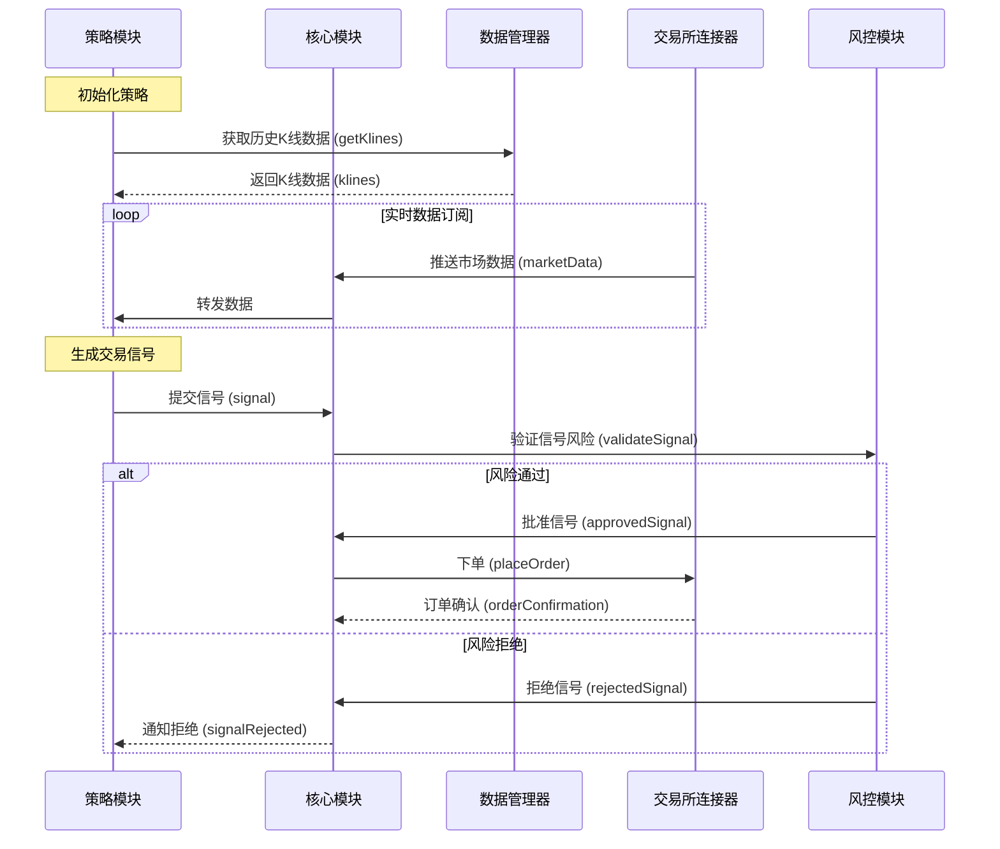

# 自定义策略示例

## 代码示例
以下是一个持续运行的自定义策略示例，结合实时数据订阅和定时任务：

```typescript
import { TypeOrmDataManager } from '@itrade/data-manager';
import { ExchangeConnector, MarketData } from '@itrade/exchange-connectors';
import { CoreModule, Signal, RiskManagement } from '@itrade/core';
import { EventEmitter } from 'events';

// 初始化模块
const dataManager = new TypeOrmDataManager({ /* 配置 */ });
await dataManager.initialize();

const exchange = new ExchangeConnector({ /* 配置 */ });
await exchange.connect();

const core = new CoreModule(dataManager, exchange);
const riskManagement = new RiskManagement({ maxPositionSize: 0.1 });

// 事件总线
const eventBus = new EventEmitter();

// 1. 订阅实时数据
exchange.subscribeMarketData('BTC/USDT', '1h', (data: MarketData) => {
  eventBus.emit('marketDataUpdate', data);
});

// 2. 定时任务（每5分钟执行一次策略）
setInterval(async () => {
  const klines = await dataManager.getKlines(
    'BTC/USDT',
    '1h',
    new Date(Date.now() - 24 * 60 * 60 * 1000), // 过去24小时数据
    new Date()
  );
  eventBus.emit('strategyTrigger', klines);
}, 5 * 60 * 1000);

// 3. 策略逻辑
eventBus.on('marketDataUpdate', (data: MarketData) => {
  console.log('收到实时数据:', data);
  // 可以在这里加入实时数据触发的逻辑
});

eventBus.on('strategyTrigger', (klines: Kline[]) => {
  const shortMa = calculateMA(klines, 5);
  const longMa = calculateMA(klines, 20);
  const lastShortMa = shortMa[shortMa.length - 1];
  const lastLongMa = longMa[longMa.length - 1];

  let signal: Signal | null = null;
  if (lastShortMa > lastLongMa) {
    signal = { symbol: 'BTC/USDT', side: 'BUY', quantity: 0.01, type: 'MARKET' };
  } else if (lastShortMa < lastLongMa) {
    signal = { symbol: 'BTC/USDT', side: 'SELL', quantity: 0.01, type: 'MARKET' };
  }

  if (signal) {
    riskManagement.validateSignal(signal).then((isApproved) => {
      if (isApproved) {
        core.executeSignal(signal!);
        console.log('订单已执行:', signal);
      }
    });
  }
});

// 辅助函数
function calculateMA(klines: Kline[], period: number): number[] {
  const closes = klines.map((k) => k.close);
  const ma: number[] = [];
  for (let i = period - 1; i < closes.length; i++) {
    const sum = closes.slice(i - period + 1, i + 1).reduce((a, b) => a + b, 0);
    ma.push(sum / period);
  }
  return ma;
}
```

## 时序图
