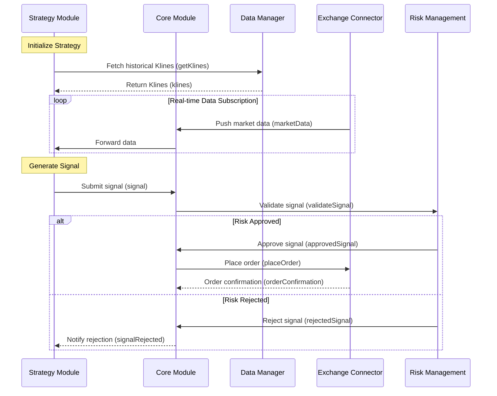

# Custom Strategy Example

## Code Example
Below is a continuously running custom strategy example, combining real-time data subscription and scheduled tasks:

```typescript
import { TypeOrmDataManager } from '@crypto-trading/data-manager';
import { ExchangeConnector, MarketData } from '@crypto-trading/exchange-connectors';
import { CoreModule, Signal, RiskManagement } from '@crypto-trading/core';
import { EventEmitter } from 'events';

// Initialize modules
const dataManager = new TypeOrmDataManager({ /* config */ });
await dataManager.initialize();

const exchange = new ExchangeConnector({ /* config */ });
await exchange.connect();

const core = new CoreModule(dataManager, exchange);
const riskManagement = new RiskManagement({ maxPositionSize: 0.1 });

// Event bus
const eventBus = new EventEmitter();

// 1. Subscribe to real-time data
exchange.subscribeMarketData('BTC/USDT', '1h', (data: MarketData) => {
  eventBus.emit('marketDataUpdate', data);
});

// 2. Scheduled task (run strategy every 5 minutes)
setInterval(async () => {
  const klines = await dataManager.getKlines(
    'BTC/USDT',
    '1h',
    new Date(Date.now() - 24 * 60 * 60 * 1000), // Last 24 hours data
    new Date()
  );
  eventBus.emit('strategyTrigger', klines);
}, 5 * 60 * 1000);

// 3. Strategy logic
eventBus.on('marketDataUpdate', (data: MarketData) => {
  console.log('Received real-time data:', data);
  // Add logic triggered by real-time data here
});

eventBus.on('strategyTrigger', (klines: Kline[]) => {
  const shortMa = calculateMA(klines, 5);
  const longMa = calculateMA(klines, 20);
  const lastShortMa = shortMa[shortMa.length - 1];
  const lastLongMa = longMa[longMa.length - 1];

  let signal: Signal | null = null;
  if (lastShortMa > lastLongMa) {
    signal = { symbol: 'BTC/USDT', side: 'BUY', quantity: 0.01, type: 'MARKET' };
  } else if (lastShortMa < lastLongMa) {
    signal = { symbol: 'BTC/USDT', side: 'SELL', quantity: 0.01, type: 'MARKET' };
  }

  if (signal) {
    riskManagement.validateSignal(signal).then((isApproved) => {
      if (isApproved) {
        core.executeSignal(signal!);
        console.log('Order executed:', signal);
      }
    });
  }
});

// Helper function
function calculateMA(klines: Kline[], period: number): number[] {
  const closes = klines.map((k) => k.close);
  const ma: number[] = [];
  for (let i = period - 1; i < closes.length; i++) {
    const sum = closes.slice(i - period + 1, i + 1).reduce((a, b) => a + b, 0);
    ma.push(sum / period);
  }
  return ma;
}
```

## Sequence Diagram
