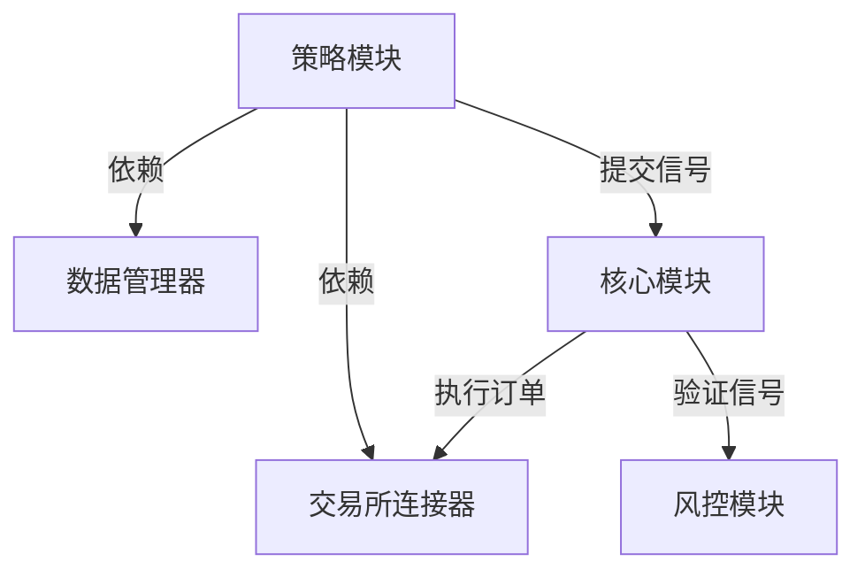

# 策略执行流程与模块依赖关系

## 模块职责
1. **数据管理器 (DataManager)**：
   - 负责存储和查询历史K线数据。
   - 提供数据质量检查和清理功能（如去重）。

2. **交易所连接器 (ExchangeConnector)**：
   - 与交易所API交互，订阅实时数据。
   - 执行订单并返回确认信息。

3. **核心模块 (Core)**：
   - 协调数据流和业务逻辑。
   - 调用风控和账户分析模块。

4. **风控模块 (RiskManagement)**：
   - 验证交易信号是否符合风控规则（如最大仓位限制）。

5. **策略模块 (Strategy)**：
   - 生成交易信号。
   - 依赖历史数据和实时数据。

## 执行流程
1. **初始化**：
   - 数据管理器、交易所连接器和核心模块初始化。

2. **数据订阅**：
   - 交易所连接器订阅实时数据并推送给核心模块。

3. **策略触发**：
   - 定时任务或实时数据更新触发策略逻辑。

4. **信号生成与验证**：
   - 策略模块生成信号并提交给核心模块。
   - 风控模块验证信号。

5. **订单执行**：
   - 通过交易所连接器执行订单。

## 依赖关系图
