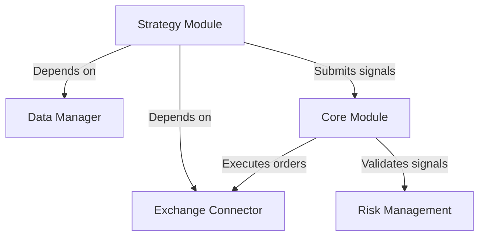

# Strategy Execution Flow and Module Dependencies

## Module Responsibilities
1. **Data Manager (DataManager)**:
   - Stores and queries historical Kline data.
   - Provides data quality checks and cleanup (e.g., deduplication).

2. **Exchange Connector (ExchangeConnector)**:
   - Interacts with exchange APIs, subscribes to real-time data.
   - Executes orders and returns confirmation.

3. **Core Module (Core)**:
   - Coordinates data flow and business logic.
   - Invokes risk and account analysis modules.

4. **Risk Management (RiskManagement)**:
   - Validates if trading signals comply with risk rules (e.g., max position size).

5. **Strategy Module (Strategy)**:
   - Generates trading signals.
   - Depends on historical and real-time data.

## Execution Flow
1. **Initialization**:
   - Data Manager, Exchange Connector, and Core Module are initialized.

2. **Data Subscription**:
   - Exchange Connector subscribes to real-time data and pushes it to Core Module.

3. **Strategy Trigger**:
   - Scheduled tasks or real-time data updates trigger strategy logic.

4. **Signal Generation & Validation**:
   - Strategy Module generates signals and submits them to Core Module.
   - Risk Management validates signals.

5. **Order Execution**:
   - Orders are executed via Exchange Connector.

## Dependency Graph
