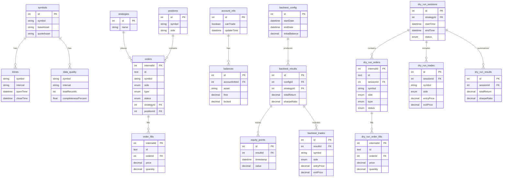

# @crypto-trading/data-manager

Professional-grade data management system for cryptocurrency trading applications with TypeORM integration.

## Overview

This package provides comprehensive data management capabilities for crypto trading systems:

- **TypeORM Integration** - Enterprise-grade ORM with PostgreSQL and MySQL support
- **Kline Data Management** - Efficient storage and retrieval of OHLCV candle data
- **File-based Storage** - JSON file storage for development and testing
- **Cache Management** - High-performance in-memory data caching
- **Data Validation** - Built-in data integrity checks and cleaning utilities

## Features

### 🗄️ Database Support

- **PostgreSQL** - Production-ready with advanced indexing
- **MySQL** - Reliable and widely supported
- **Connection Pooling** - Optimized database connections
- **Migrations** - Schema version management

### 📊 Data Models

- **Kline/Candle Data** - OHLCV with volume and trade count
- **Symbol Management** - Trading pair definitions
- **Timeframe Support** - Multiple interval configurations
- **Metadata Tracking** - Data source and quality metrics

### 🚀 Performance Features

- **Batch Operations** - Efficient bulk data processing
- **Indexing Strategy** - Optimized for time-series queries
- **Memory Caching** - Configurable TTL-based caching
- **Query Optimization** - Specialized methods for trading data patterns

## Installation

```bash
pnpm add @crypto-trading/data-manager @crypto-trading/core
```

## Database Setup

### PostgreSQL

```typescript
import { TypeOrmDataManager } from '@crypto-trading/data-manager';

const dataManager = new TypeOrmDataManager({
  type: 'postgres',
  host: 'localhost',
  port: 5432,
  username: 'trader',
  password: 'password',
  database: 'crypto_trading',
});
```

### MySQL

```typescript
const dataManager = new TypeOrmDataManager({
  type: 'mysql',
  host: 'localhost',
  port: 3306,
  username: 'trader',
  password: 'password',
  database: 'crypto_trading',
});
```

## Usage Examples

### Basic Operations

```typescript
import { TypeOrmDataManager, FileDataManager } from '@crypto-trading/data-manager';

// Initialize with database
const dataManager = new TypeOrmDataManager(dbConfig);
await dataManager.initialize();

// Store historical data
const klines = [
  {
    symbol: 'BTCUSDT',
    interval: '1h',
    openTime: new Date('2024-01-01T00:00:00Z'),
    closeTime: new Date('2024-01-01T01:00:00Z'),
    open: new Decimal('45000'),
    high: new Decimal('45100'),
    low: new Decimal('44900'),
    close: new Decimal('45050'),
    volume: new Decimal('10.5'),
    quoteVolume: new Decimal('472500'),
    trades: 150
  }
];

await dataManager.saveKlines('BTCUSDT', '1h', klines);

// Retrieve data for analysis
const historicalData = await dataManager.getKlines(
  'BTCUSDT',
  '1h',
  new Date('2024-01-01'),
  new Date('2024-01-02')
);
```

### Advanced Queries

```typescript
// Get latest candle for each symbol
const latestCandles = await dataManager.getLatestKlines(['BTCUSDT', 'ETHUSDT'], '1h');

// Batch operations for multiple symbols
const symbols = ['BTCUSDT', 'ETHUSDT', 'ADAUSDT'];
await dataManager.batchSaveKlines(bulkKlineData);

// Data quality checks
const validationResults = await dataManager.validateDataIntegrity('BTCUSDT', '1h');
```

### Caching Integration

```typescript
import { CacheManager } from '@crypto-trading/data-manager';

const cache = new CacheManager({
  defaultTTL: 60000, // 1 minute
  maxSize: 1000
});

// Cache recent data for quick access
cache.setKlines('BTCUSDT', '1m', recentKlines, 30000); // 30s TTL
const cached = cache.getKlines('BTCUSDT', '1m');
```

## Configuration

### Database Connection Options

```typescript
interface DatabaseConfig {
  type: 'postgres' | 'mysql';
  host: string;
  port: number;
  username: string;
  password: string;
  database: string;
  ssl?: boolean;
  connectionLimit?: number;
  acquireTimeout?: number;
  timeout?: number;
  logging?: boolean | LoggerOptions;
}
```

### File Storage Configuration

```typescript
const fileManager = new FileDataManager('./market-data', {
  compression: true,
  partitioning: 'daily', // 'hourly' | 'daily' | 'monthly'
  maxFileSize: '100MB',
  autoCleanup: true,
  retentionDays: 30
});
```

### Cache Configuration

```typescript
const cacheConfig = {
  defaultTTL: 300000, // 5 minutes
  maxSize: 5000,
  checkPeriod: 60000, // Cleanup interval
  enableStats: true,
  compressionThreshold: 1024 // Compress large objects
};
```

## Data Models

### Entity Relationship Diagram



Note: Some links (e.g., `symbols` to `klines`/`data_quality`) are logical relations by fields rather than enforced foreign keys.

### Kline Entity

```typescript
interface KlineData {
  symbol: string;
  interval: string;
  openTime: Date;
  closeTime: Date;
  open: Decimal;
  high: Decimal;
  low: Decimal;
  close: Decimal;
  volume: Decimal;
  quoteVolume: Decimal;
  trades: number;
  takerBuyBaseVolume?: Decimal;
  takerBuyQuoteVolume?: Decimal;
}
```

## Performance Optimization

### Database Indexing

- **Primary Index**: `(symbol, interval, openTime)`
- **Time Range Index**: `(openTime, closeTime)`
- **Symbol Index**: `(symbol)` for cross-timeframe queries
- **Composite Index**: `(symbol, interval)` for symbol-specific queries

### Memory Management

```typescript
// Configure connection pooling
const poolConfig = {
  min: 2,
  max: 10,
  acquireTimeoutMillis: 30000,
  createTimeoutMillis: 30000,
  destroyTimeoutMillis: 5000,
  idleTimeoutMillis: 30000,
  reapIntervalMillis: 1000,
  createRetryIntervalMillis: 200
};
```

## Data Migration

### From JSON Files

```typescript
import { MigrationHelper } from '@crypto-trading/data-manager';

const migrator = new MigrationHelper(dataManager);

// Migrate existing JSON data to database
await migrator.migrateFromFiles('./historical-data', {
  batchSize: 1000,
  skipExisting: true,
  validateData: true
});
```

### Between Databases

```typescript
// Migrate between different database systems
await migrator.migrateBetweenDatabases(sourceConfig, targetConfig, {
  symbols: ['BTCUSDT', 'ETHUSDT'],
  intervals: ['1m', '5m', '1h'],
  dateRange: { start: '2024-01-01', end: '2024-12-31' }
});
```

## Monitoring & Analytics

### Data Quality Metrics

```typescript
const metrics = await dataManager.getDataQualityMetrics('BTCUSDT', '1h');
console.log(metrics);
// {
//   totalRecords: 8760,
//   missingCandles: 5,
//   duplicateCandles: 0,
//   dataCompleteness: 99.94,
//   avgGapSize: '1h',
//   lastUpdate: '2024-01-15T10:00:00Z'
// }
```

### Performance Monitoring

```typescript
// Enable query performance logging
const dataManager = new TypeOrmDataManager({
  ...config,
  logging: ['query', 'slow'],
  slowQueryThreshold: 1000 // Log queries > 1 second
});

// Get performance statistics
const stats = await dataManager.getPerformanceStats();
```

## Error Handling

```typescript
try {
  await dataManager.saveKlines(symbol, interval, klines);
} catch (error) {
  if (error instanceof DuplicateDataError) {
    // Handle duplicate data
    console.log('Data already exists, skipping...');
  } else if (error instanceof ValidationError) {
    // Handle validation errors
    console.error('Invalid data format:', error.details);
  } else {
    // Handle database errors
    console.error('Database error:', error.message);
  }
}
```

## Best Practices

### 1. Connection Management

```typescript
// Always initialize before use
await dataManager.initialize();

// Gracefully close connections
process.on('SIGTERM', async () => {
  await dataManager.close();
});
```

### 2. Batch Operations

```typescript
// Use batch operations for bulk data
const BATCH_SIZE = 1000;
for (let i = 0; i < largeDataset.length; i += BATCH_SIZE) {
  const batch = largeDataset.slice(i, i + BATCH_SIZE);
  await dataManager.batchSaveKlines(batch);
}
```

### 3. Query Optimization

```typescript
// Use specific date ranges to leverage indexes
const data = await dataManager.getKlines(
  'BTCUSDT',
  '1h',
  startDate,  // Specific start
  endDate,    // Specific end
  1000        // Reasonable limit
);
```

## API Reference

### TypeOrmDataManager

- `initialize()` - Initialize database connection
- `saveKlines(symbol, interval, klines)` - Save candle data
- `getKlines(symbol, interval, start, end, limit?)` - Retrieve candle data
- `batchSaveKlines(data)` - Bulk save operation
- `validateDataIntegrity(symbol, interval)` - Data validation
- `getAvailableSymbols()` - List all symbols
- `getAvailableIntervals(symbol)` - List intervals for symbol
- `cleanupOldData(retentionDays)` - Remove old data
- `close()` - Close database connections

### FileDataManager

- `saveKlines(symbol, interval, klines)` - Save to JSON files
- `getKlines(symbol, interval, start, end, limit?)` - Load from files
- `validateData(symbol, interval)` - File data validation
- `cleanData(symbol, interval)` - Remove duplicates
- `getAvailableSymbols()` - List stored symbols

### CacheManager

- `setKlines(symbol, interval, data, ttl?)` - Cache data
- `getKlines(symbol, interval)` - Retrieve cached data
- `invalidateSymbol(symbol)` - Clear symbol cache
- `getStats()` - Cache performance statistics
- `clear()` - Clear all cached data

## Contributing

When contributing to this package:

1. **Database Changes**: Update migrations and entity definitions
2. **Performance**: Benchmark query performance with sample data
3. **Testing**: Test with both PostgreSQL and MySQL
4. **Documentation**: Update API documentation and examples

## Dependencies

- **TypeORM** - Database ORM and query builder
- **pg** - PostgreSQL client
- **mysql2** - MySQL client  
- **decimal.js** - Precision decimal arithmetic
- **@crypto-trading/core** - Core types and interfaces
